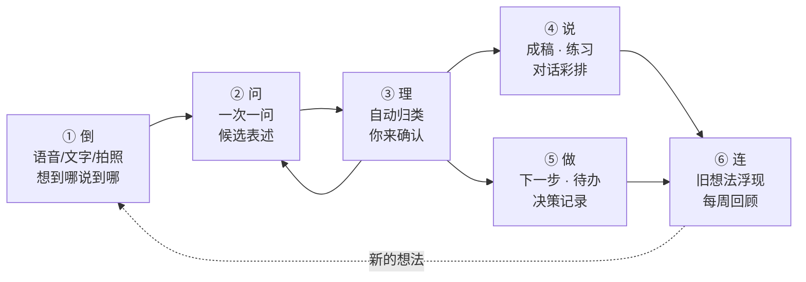

# 04 · 产品构思：从"一团乱麻"到"说得清、做得到"

> 基于 01–03 的调研，本文给出产品定位、核心闭环、场景设计和功能发散清单。
> 标 🧪 的功能有认知科学研究支撑（依据见 [02-用户洞察](02-user-insights.md) 和文末参考）。
> 优先级：**P0** = MVP 必做，**P1** = 第一批迭代，**P2** = 有余力再做，**🔮** = 远期/实验。

---

## 1. 定位

**一句话**：你只管乱说，它帮你理出头绪、说清楚、做下去。

英文 slogan 候选：*Talk messy. Think clear.*

**它不是**：

- 又一个"更好用的思维导图编辑器"——XMind、MindNode 在编辑体验上已经很成熟，正面拼编辑器没有胜算；
- "把文章/视频变成导图"的总结工具——这是 Mapify、NotebookLM、GitMind 的主场，而且总结的是**别人的内容**；
- 替你思考的聊天机器人——ChatGPT、豆包什么都能答，但答出来的不是**你的**想法，而且对话是线性的，想完就散。

**它是**：一个**会倾听、会追问、会帮你找词**的 AI 思考伙伴。思维导图是这个过程中"看得见的思考"——你说，它长；你改，它学。

### 1.1 和现有产品的分工对比

| 环节 → | ① 倒出来 | ② 被追问 | ③ 理结构 | ④ 说出口 | ⑤ 去行动 | ⑥ 连起来 |
|---|---|---|---|---|---|---|
| 传统导图（XMind、MindNode、知犀） | 手动逐个建节点 | — | ✅ 手动 | 导出图片/大纲 | — | — |
| AI 总结导图（Mapify、NotebookLM、秘塔） | 外部内容 | — | ✅ 自动 | 部分 | — | — |
| 语音笔记（AudioPen、Get 笔记、flomo） | ✅ 语音/碎片 | — | 线性文本 | 改写 | 部分 | 部分 |
| AI 日记/教练（Rosebud、Mindsera） | 文字/语音 | ✅ | — | — | 部分 | ✅ 洞察 |
| 通用 AI 助手（ChatGPT、豆包、DeepSeek） | ✅ | 要你会提问 | 线性文本 | ✅ | — | 记忆 |
| **我们** | ✅ 语音优先 | ✅ 一次一问 | ✅ 可视、可改 | ✅ 成稿 + 练习 | ✅ | ✅ |

没有一个现有产品把这 6 步串成闭环。**闭环本身就是产品。**

---

## 2. 目标用户

"思维乱"不是一个人群，是很多人在某些时刻的状态。MVP 先聚焦前三类：

| 画像 | 典型时刻 | 付费意愿 |
|---|---|---|
| **脑子很满的职场人**（25–40 岁） | 写周报、汇报、述职前；开会想发言但组织不好语言；下班后脑子停不下来 | 高 |
| **表达焦虑者** | 面试、答辩、演讲、谈加薪、和伴侣/父母沟通之前 | 高（场景刚需） |
| **内耗的年轻人**（学生/职场新人） | 考研还是工作、换不换城市，反复纠结；情绪和想法搅在一起 | 中 |
| 灵感多的创作者/创业者 | 点子很多但碎片化，想做内容/副业却落不了地 | 中高 |
| ADHD 及神经多样性人群 | 执行功能困难，需要外部结构把事情拆开 | 中（海外更成熟） |

**要完成的任务（JTBD）**：

1. 当我脑子里一团乱时，我想**快速倒出来并看到它被整理好**，这样我能平静下来、知道先做什么。
2. 当我有个模糊的想法时，我想**有人问我好问题**，帮我把它想透、说清楚。
3. 当我要去汇报/面试/沟通时，我想**把要说的东西组织成清晰的结构，并练到能说出口**。
4. 当我面临选择时，我想**看清所有考虑因素**，做一个事后不后悔的决定。

---

## 3. 核心闭环：倒 → 问 → 理 → 说 → 做 → 连

### ① 倒（Dump）：零门槛倾倒

按住说话，想到哪说到哪，"嗯、啊、那个"和停顿都没关系。也可以打字、拍照（手写/白板 OCR）、从其他 App 分享文字或链接进来。

- **魔法时刻：边说边长的导图**——你说话的同时，节点一个个长出来，自动挂到对应分支上。这是产品最直观的"哇"时刻，也是最适合拍成短视频传播的画面。
- 入口要多、要快：App 内大按钮、锁屏小组件、操作按钮（Action Button）、控制中心、Apple Watch、Siri/快捷指令、分享菜单。

### ② 问（Probe）：AI 当一个好的提问者

一次只问一个问题，问题要短、要具体。追问有几种类型：

| 类型 | 例子 |
|---|---|
| 澄清 | "你说的'累'，是身体累还是心累？" |
| 深挖 | "为什么这件事对你这么重要？" |
| 举例 | "能说一个具体发生过的例子吗？" |
| 反面 | "如果不这么做，最坏会怎样？" |
| 补盲 | "你提到了钱和时间，还没提到家人的看法。" |
| 收敛 | "如果只能留一条理由，你留哪条？" |

**帮你说出来（候选表述）** 🧪：当你卡住、只能说出"就是那种感觉……"时，AI 给出 **3 个意思不同的候选说法**："你想表达的更接近哪个？"——你只需要选、再改一改，而不必从零组织语言。原理是"再认比回忆容易"：从选项里认出自己的意思，远比凭空找到那个词轻松。

回答方式：说一句、点选项、或者"跳过"。不回答也完全没关系。

### ③ 理（Structure）：AI 来整理，但你是作者

- **自动整理**：去掉口水词、合并重复、归类、找出中心问题、判断层级。
- **给每个节点贴标签**：事实 / 观点 / 感受 / 假设 / 问题 / 待办，用颜色区分。一眼就能看出"哪些是我确定知道的，哪些只是我的担心"。
- **一键套框架**：利弊、SWOT、5W2H、金字塔、鱼骨、2×2 矩阵、时间线。AI 把已有节点重新填进框架，并**高亮空着的格子**——空格就是你还没想到的地方。
- **所有权清晰**：AI 补充的节点以虚线"幽灵态"显示，你确认后才变成你的节点；每个节点都能点开看到你的**原话**。

### ④ 说（Express）：从"想清楚"到"说出口"

这是大多数导图产品的终点，却是我们的第二个重点。

- **一键成稿**：一句话版 / 30 秒电梯版 / 3 分钟讲稿 / 文章 / 邮件 / 周报 / 汇报提纲 / 朋友圈 / 小红书笔记。可选表达结构：结论先行（金字塔原理）、SCQA、PREP（观点—理由—例子—观点）、STAR（面试）、NVC 非暴力沟通（观察—感受—需要—请求）。
- **保留你的口吻**：用你自己说过的词和句式来写，而不是一股"AI 腔"；AI 自己补的句子要能被标出来。
- **说出来练习**：对着手机讲一遍，AI 对照导图检查：要点有没有漏、结论是不是先说了、口头禅（"然后""就是""那个"）多不多、语速和时长。每次最多给 3 条具体建议。
- **对话彩排**：AI 扮演老板、面试官、客户或伴侣，按你的导图和你模拟对话，并追问你没准备好的地方。

### ⑤ 做（Act）：让想法落地

- 从导图中提取待办，一键加入"提醒事项"或"日历"。
- **下一步最小行动** 🧪：每次整理结束问一句"接下来 10 分钟内你能做的一件事是什么？"——研究发现，为未完成的目标定一个具体计划，就能明显减少它在脑子里反复打转（Masicampo & Baumeister, 2011）。
- **如果—就计划** 🧪：把行动写成"如果［情境］，我就［行动］"（执行意图，Gollwitzer & Sheeran 2006 的元分析显示对目标达成有中到大的效应）。
- **决策记录**：记下当时的考虑和选择，3 个月后提醒你回看"当时想得对吗"。

### ⑥ 连（Connect）：想法不只活在一张图里

- **"你以前也想过"**：新想法出现时，浮现过去相关的节点和导图。
- **每周回顾**：这周反复出现的主题、没解决的问题、做了哪些决定、情绪天气。
- **想法孵化器**：标为"孵化中"的想法，隔几天 AI 带着一个新问题来"浇水"。
- **思维图谱**：所有导图的节点连成一张个人知识网络，可以按主题漫游。

---

## 4. 场景化入口：不从空白画布开始

空白画布是思维混乱者最大的敌人——"中心主题写什么？"就已经卡住了。首页应该问"你现在是哪种状态？"，每个场景背后是一套框架 + 一种 AI 角色 + 一种产出。

| 场景 | 用户心声 | 背后的框架 | AI 角色 | 产出 |
|---|---|---|---|---|
| 🌀 脑子好乱 | "事情太多，不知道从哪开始" | 清空大脑（GTD 收集）→ 分类 → 重要/紧急 2×2 | 倾听者 | 分好类的导图 + "现在最该做的 1 件事" |
| 💡 有个想法 | "我有个点子，但说不清楚" | 5W2H；创业想法用精益画布 | 教练 | 想法导图 + 验证清单 |
| ⚖️ 纠结一件事 | "要不要换工作？" | 选项 × 标准矩阵、利弊、事前验尸、10-10-10 法则 | 教练 + 魔鬼代言人 | 决策导图 + 决策记录 |
| 🎤 想说清楚 | "明天要汇报/面试/谈话" | 金字塔原理、SCQA、PREP、STAR | 模拟听众 | 讲稿 + 练习反馈 |
| ✍️ 想写点什么 | "有感而发，但写不出来" | 观点—论据—例子 | 编辑 | 文章大纲 → 你口吻的初稿 |
| 📚 学到了东西 | "看完一本书/一个视频，想真正消化" | 费曼学习法、主动回忆 | 好奇的学生 | "我的理解"导图 + 自测题 |
| 🌧️ 心里不舒服 | "说不上来，就是难受" | 情绪命名、CBT 思维记录（情境—想法—情绪—证据—替代想法） | 倾听者 | 情绪地图 + 一个温和的替代想法 |
| 🎯 定个目标 | "今年想做成几件事" | OKR / 目标拆解 / 如果—就计划 | 教练 | 目标树 + 待办 |
| 🔁 复盘 | "这个项目/这周过得怎么样" | 复盘四步（回顾目标—评估结果—分析原因—总结规律）/ KPT | 教练 | 复盘导图 + 经验卡片 |
| 💬 聊完整理 | "刚开完会，脑子里一堆信息" | 要点—分歧—待办 | 记录员 | 会谈导图 + 待办 |

另外保留"自由模式"（空白画布）给熟练用户。

---

## 5. AI 伙伴：角色 + 介入程度

### 5.1 角色

| 角色 | 行为 | 适用 |
|---|---|---|
| 倾听者 | 主要做复述和确认（"我听到的是……对吗？"），很少提建议 | 情绪、清空大脑 |
| 教练 | 开放式提问，帮你自己找到答案 | 大部分场景（默认） |
| 魔鬼代言人 | 专门挑战你的假设："如果这个前提不成立呢？" | 决策、方案 |
| 好奇的学生 | 费曼式："能用小学生能听懂的话讲一遍吗？" | 学习 |
| 模拟听众 | 扮演老板/面试官/客户，问他们会问的问题 | 表达准备 |
| 六顶帽子圆桌 | 6 个视角轮流发言（事实/情感/风险/利益/创意/控制） | 复杂问题 🔮 |
| 未来的你 | 从 5 年后的视角看这件事 | 纠结、人生选择 |

### 5.2 介入程度（用户可调）

- 🤫 **安静整理**：只整理你说的，不提问、不补充。
- 🙋 **会追问**（默认）：整理 + 一次一问。
- 🚀 **敢补充**：整理 + 追问 + 主动补充新视角和信息（明确标注为 AI 补充）。

**设计铁律**：默认先问后答；AI 的"答案"永远以"建议"形态出现，需要你确认。这既是为了保住"想法是你的"，也是为了避免用户把思考外包出去（见 02 中关于 AI 过度依赖的研究）。

---

## 6. 功能发散全景

### A. 捕获：让想法零摩擦地进来

| 功能 | 说明 | 优先级 |
|---|---|---|
| 一键倾诉 | 按住说话，端侧实时转写，边说边长导图 | P0 |
| 文字倾倒 | 不分段、不排版，随便打 | P0 |
| 灵感收集箱 | 所有碎片先进收集箱，AI 每周自动聚类成主题 | P1 |
| 锁屏/桌面小组件、操作按钮、控制中心 | 1 秒进入录音 | P1 |
| 分享扩展 | 从微信、浏览器、备忘录分享文字/链接进来当"素材" | P1 |
| 拍照/手写识别 | 纸上草稿、白板照片 → 节点 | P2 |
| Apple Watch 抬腕记录 | 散步、跑步时说一句 | P2 |
| **散步模式** 🧪 | 戴 AirPods 边走边说，AI 偶尔用语音追问一句；回家后得到一张导图。步行时发散思维的创意产出平均提高约 60%（Oppezzo & Schwartz, 2014） | P1 |
| **睡前清空** 🧪 | 睡前 5 分钟把明天要做的事和担心的事倒出来。研究发现睡前写具体的待办清单，入睡平均快约 9 分钟（Scullin et al., 2018） | P1 |

### B. 澄清：帮你把话说出来

| 功能 | 说明 | 优先级 |
|---|---|---|
| 一次一问 | 苏格拉底式追问，问题短、具体、可跳过 | P0 |
| **候选表述**"你是不是想说……" 🧪 | 3 个意思不同的候选，选一个再改 | P0 |
| 模糊词侦测 | 标出"感觉""有点""一些""那个"，轻轻问一句具体指什么 | P1 |
| 一句话挑战 | "用一句话说出你的核心想法"，AI 反馈后迭代 | P1 |
| 事实/观点/感受/假设标注 | 颜色区分，帮你分清"发生了什么"和"我怎么看" | P1 |
| 情绪词轮盘 🧪 | 从"难受"细化到"委屈""失落""被忽视"；情绪分辨得越细，越能调节（Barrett et al., 2001） | P2 |

### C. 结构化与可视化

| 功能 | 说明 | 优先级 |
|---|---|---|
| AI 自动归类、合并重复、提炼中心问题 | 倾倒结束后整体整理一遍 | P0 |
| 原生导图编辑 | 拖拽、折叠、改文字、撤销；手感必须好 | P0 |
| 大纲视图 | 与导图双向同步（像幕布） | P0 |
| 原话溯源 | 点节点看到原始语音片段和文字 | P1 |
| 框架一键套用 + 空格高亮 | 利弊、SWOT、5W2H、金字塔、鱼骨、2×2、时间线 | P1 |
| 结构体检（MECE） | 指出重叠的分支和缺失的维度 | P2 |
| 盲区雷达 | 找出彼此没有连接的想法簇，生成"桥接问题"（受 InfraNodus 启发） | P2 |
| 多视图 | 卡片白板、看板、时间线 | P2 |

### D. 表达与输出

| 功能 | 说明 | 优先级 |
|---|---|---|
| 一键成稿（多格式、多长度） | 一句话 / 30 秒 / 3 分钟 / 文章 / 邮件 / 周报 / 汇报提纲 | P0 |
| 表达结构选择 | 金字塔、SCQA、PREP、STAR、NVC | P1 |
| 你的口吻 | 学习你说话的用词和句式 | P1 |
| 说出来练习 | 讲一遍 → 要点覆盖、结论位置、口头禅、语速、时长 → 最多 3 条建议 | P1 |
| 对话彩排 | AI 扮演对方，模拟汇报/面试/谈话 | P2 |
| 模拟提问 | 预测听众最可能问的 5 个问题 | P1 |
| 分享卡片 | 导图 → 好看的竖版图片，适合小红书/朋友圈（也是增长渠道） | P1 |
| 导出 | PNG、PDF、Markdown、OPML、XMind、演示文稿大纲 | P0（PNG/Markdown）/ P2（其余） |
| 提词器 | 按导图顺序滚动要点，练习或正式发言时用 | P2 |

### E. 行动与决策

| 功能 | 说明 | 优先级 |
|---|---|---|
| 待办提取 → 提醒事项/日历 | EventKit 一键同步 | P1 |
| 下一步最小行动 🧪 | 每次整理结束问一句 | P0 |
| 如果—就计划 🧪 | 执行意图模板 | P2 |
| 决策矩阵 | 选项 × 标准打分，AI 帮你找出你没说出口的标准 | P1 |
| 事前验尸 | "假设一年后这个决定失败了，最可能是因为什么？" | P1 |
| 决策记录 + 回访 | 3 个月后提醒回看 | P2 |
| what-if 沙盘 | 每个选项往下推演二阶后果，长出"如果……会怎样"的分支 | 🔮 |

### F. 连接与回顾

| 功能 | 说明 | 优先级 |
|---|---|---|
| "你以前也想过" | 语义检索过去的节点并浮现 | P1 |
| 每周回顾 | 主题、未解决问题、决定、情绪天气 | P1 |
| 想法孵化器 | 孵化中的想法定期被"浇水" | P2 |
| 思维图谱 | 全部节点的个人知识网络 | P2 |
| 观点演化史 | 你对同一件事的看法如何随时间变化 | 🔮 |
| 我的原则库 | 从你的历次决策中提炼你的价值排序（"你做决定时最看重：自由 > 收入 > 稳定"） | 🔮 |
| 思考习惯画像 | "你很擅长拆解，但很少反驳自己"——元认知反馈 | 🔮 |
| 年度思维报告 | 可分享的年度回顾（增长渠道） | 🔮 |

### G. 情绪与自我觉察（边界要清晰）

| 功能 | 说明 | 优先级 |
|---|---|---|
| 情绪清空模式 | 倾听者角色，只复述不评判 | P1 |
| CBT 思维记录模板 | 情境—自动想法—情绪—证据—替代想法 | P2 |
| 危机语言识别 | 识别到自伤等风险表达时，停止普通流程，展示专业求助资源 | P0（上线前必须有） |

> 定位是"自我整理工具"，不是心理治疗；文案和审核都要避开医疗宣称。

### H. 学习

| 功能 | 说明 | 优先级 |
|---|---|---|
| 费曼模式 | 你讲给 AI 听，AI 扮演好奇的学生追问，找出你理解的漏洞 | P2 |
| 读后感导图 | 不是总结书，而是问"你同意吗？和你的经历有什么关系？"，长出**你自己的观点** | P2 |
| 自测与间隔复习 | 从你的导图生成问题，定期回顾 | 🔮 |

### I. 多人

| 功能 | 说明 | 优先级 |
|---|---|---|
| 分享只读链接 / 请朋友评论 | "帮我看看" | P2 |
| **分歧地图** | 两个人分别说出对同一件事的想法，AI 合成一张图，标出共识、分歧和误解。适合情侣、合伙人、父母与孩子 | 🔮 |
| 异步头脑风暴 🧪 | 每人先独立说，再由 AI 合并——比当面七嘴八舌更高效（经典研究发现互动小组因"生产阻塞"产出低于独立思考再合并的名义小组，Diehl & Stroebe, 1987） | 🔮 |
| 模板社区 | 用户/专家分享思考模板 | 🔮 |

### J. Apple 生态深度整合

| 功能 | 说明 | 优先级 |
|---|---|---|
| App Intents / Siri / 快捷指令 | "嘿 Siri，帮我理一下思路"；快捷指令动作"把文本整理成导图" | P1 |
| 小组件 | "今日一问"、"孵化中的想法" | P1 |
| iPad + Apple Pencil | 手写节点、圈选归类 | P2 |
| Mac 版 | 键盘流大纲编辑 | P2 |
| 实时活动 | 散步模式进行中显示在灵动岛 | P2 |
| Vision Pro 思维空间 | 沉浸式 3D 导图 | 🔮 |

### K. 训练与成长（可做成付费内容）

| 功能 | 说明 | 优先级 |
|---|---|---|
| 表达训练营 | 每天 3 分钟：一句话总结 → 三点论 → PREP → 电梯演讲 → 即兴发言，AI 逐次反馈 | P2 |
| 思维动作卡 | 卡住时抽一张：反过来想 / 举个例子 / 往上抽象 / 往下拆 / 换个人的视角……（类似 Brian Eno 的 Oblique Strategies 创意卡） | P1 |
| 垂直场景包 | 职场汇报与述职、结构化面试、作文提纲、答辩 | P2 |

---

## 7. 差异化与护城河

1. **从"我的乱想"出发**：竞品大多在整理别人的内容，我们整理你脑子里还说不清的东西。
2. **追问 + 候选表述**：直接解决"说不出来"，这是生成一张导图解决不了的。
3. **原话溯源 + 你的口吻**：用户能感觉到"这是我的想法"，而不是 AI 的作文。
4. **表达闭环**：导图 → 讲稿 → 练习 → 彩排，导图不是终点。
5. **长期思维档案**：用得越久，关联、回顾、原则库越有价值，迁移成本自然形成。
6. **隐私优先**：想法是最私密的数据。本地优先存储、端侧 AI 能做的不上云、上云必须明确告知并取得同意。
7. **中文场景深耕**：职场汇报、复盘、面试、作文提纲等中国用户高频场景，做深模板和话术。

---

## 8. 命名灵感

上架前需查商标和 App Store 重名。

- **头绪**——"理出头绪"，正好是用户的痛点
- **捋捋**——口语里的"我捋一捋"，亲切
- **想明白** / **说清楚**——直接讲结果
- **念头**——轻、私密
- 英文：*Untangle*、*Tidy Mind*、*Talk to Think*、*Mindful Map*

---

## 9. 北极星指标

**每周完成的"思考闭环"数**：一次会话以一个明确产出结束（确认导图 / 成稿 / 做出决定 / 生成待办）。

辅助指标：

- 首张导图生成时间（目标 < 60 秒）
- AI 建议节点采纳率、追问回答率（衡量 AI 质量）
- 成稿导出率、练习完成率（衡量"说"环节价值）
- 次日/7 日/30 日留存；每周活跃天数

---

## 参考（本文引用的研究）

- Oppezzo, M., & Schwartz, D. L. (2014). Give your ideas some legs: The positive effect of walking on creative thinking. *Journal of Experimental Psychology: Learning, Memory, and Cognition*. [Stanford 报道](https://news.stanford.edu/stories/2014/04/walking-vs-sitting-042414) · [APA PDF](https://www.apa.org/pubs/journals/releases/xlm-a0036577.pdf)
- Scullin, M. K., et al. (2018). The effects of bedtime writing on difficulty falling asleep: A polysomnographic study comparing to-do lists and completed activity lists. *Journal of Experimental Psychology: General*. [Baylor 报道](https://kellercenter.hankamer.baylor.edu/news/story/2018/effects-bedtime-writing)
- Masicampo, E. J., & Baumeister, R. F. (2011). Consider it done! Plan making can eliminate the cognitive effects of unfulfilled goals. *Journal of Personality and Social Psychology*, 101, 667–683. [PDF](https://users.wfu.edu/masicaej/MasicampoBaumeister2011JPSP.pdf)
- Barrett, L. F., Gross, J., Christensen, T. C., & Benvenuto, M. (2001). Knowing what you're feeling and knowing what to do about it. *Cognition and Emotion*, 15(6), 713–724. [PDF](https://www.affective-science.org/pubs/2001/01MaprelationDiffReg.pdf)
- Gollwitzer, P. M., & Sheeran, P. (2006). Implementation intentions and goal achievement: A meta-analysis of effects and processes. *Advances in Experimental Social Psychology*, 38, 69–119.
- Diehl, M., & Stroebe, W. (1987). Productivity loss in brainstorming groups: Toward the solution of a riddle. *Journal of Personality and Social Psychology*, 53(3), 497–509.
