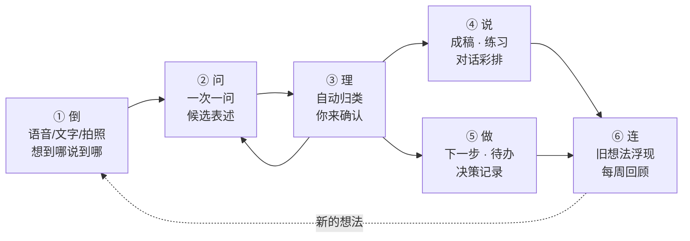

# 04 · 产品构思：从"一团乱麻"到"说得清、做得到"

> 基于 01–03 的调研，本文给出产品定位、核心闭环、场景设计和功能发散清单。
> 标 🧪 的功能有认知科学研究支撑（依据见 [03-用户洞察](03-user-insights.md) 和文末参考）。
> 优先级：**P0** = MVP 必做，**P1** = 第一批迭代，**P2** = 有余力再做，**🔮** = 远期/实验。
>
> 2026-09-26 第二轮更新：按 [08-用户声音](08-user-voices.md)（约 3,700 条 App Store 评论 + 70 条英文社区原话）调整了功能优先级（原话溯源、锁屏入口升为 P0，情绪词候选升为 P1，新增录音零丢失、iPhone 重组操作等验收标准）；§1.1 补上语音产品和表达训练的新动向；§7 按新进入者重写；§8 命名附上重名初查结果。另并入 [附录 07a](appendix/07a-overseas-compliance.md)（海外合规）和 [附录 03a](appendix/03a-voice-and-demand.md)（语音习惯）：§4"心里不舒服"入口补美国版处理；§5.1 新增角色边界；§6 A 补轻声、默认打字和文案口径；§6 G 的情绪用词和危机协议对齐合规清单；§6 L 新增"AI 身份披露 + 连续使用提醒""不做操纵性留存"两行；§7 隐私优先补"不做广告、不出售或共享对话内容"。
>
> **2026-09-26 定位确认：本产品是"归纳、总结、分析"你自己想法的工具，不是陪聊或情绪陪伴 AI。** 据此删去"心里不舒服"场景、"倾听者"和"未来的你"角色、情绪清空模式、"先说感受"、CBT 思维记录和每周回顾里的"情绪天气"；危机提示改为轻量版；去掉"连续使用提醒"；新增 §6 M 免费与付费的边界（免费用，AI 功能付费）。
>
> **2026-09-26 阶段决定**（[07 §0](07-compliance-business-roadmap.md)）：现阶段完全免费；AI 只用 Apple 端侧模型和私有云（PCC），不支持 Apple 智能的设备只提供不用 AI 的功能。§6 M 的付费分档暂缓、保留作以后收费参考；§6 L"端侧优先"升为 P0，"透明计费"留到以后收费时再做。
>
> 2026-09-26 终稿核查：§4 注、§5.1、§6 G、§6 L、§7-6 引用的法条逐条打开原文复核（犹他 HB 452、内华达 AB 406、伊利诺伊 IDFPR 新闻稿、纽约 §1700/§1702、加州 SB 243、华盛顿 HB 2225、网信办拟人化办法第二、八、十、十八条、欧盟 AI 法第 3(39) 条 / 附件 III / 第 50 条、Apple 5.1.3(i)），与原文和[附录 07a](appendix/07a-overseas-compliance.md) 一致；参考文献 11 个 DOI 经 Crossref 核对；Scullin、Oppezzo、Gollwitzer 的数字按原文核对无误。更正 2 处引用出处（§5.2、§7-1）。

---

## 1. 定位

**一句话**：你只管乱说，它帮你理出头绪、说清楚、做下去。

英文 slogan 候选：*Talk messy. Think clear.*

**它不是**：

- 又一个"更好用的思维导图编辑器"——XMind、MindNode 在编辑体验上已经很成熟，正面拼编辑器没有胜算；
- "把文章/视频变成导图"的总结工具——这是 Mapify、NotebookLM、GitMind 的主场，而且总结的是**别人的内容**；
- 替你思考的聊天机器人——ChatGPT、豆包什么都能答，但答出来的不是**你的**想法，而且对话是线性的，想完就散；
- **陪聊或情绪陪伴 AI**——它不和你闲聊、不安慰你、不扮演谁，只把你说的内容归纳、整理、分析清楚。

**它是**：一个**归纳、总结、分析你自己想法**的 AI 工具——你说，它整理成结构、问清楚模糊的地方、帮你找到合适的词。思维导图是这个过程中"看得见的思考"——你说，它长；你改，它学。

> **对外（App 名、副标题、宣传语）统一说"思考整理 / 效率工具"**，不用"伙伴""陪伴"：美国纽约州对"陪伴型 AI"的豁免看系统被"设计并推广"的主要用途，国内《拟人化互动办法》也针对人设化的情感互动（见 [07 §2.5](07-compliance-business-roadmap.md)、§2.1）。"thinking partner"只放进 App Store 不公开的关键词字段（[07 §4.4](07-compliance-business-roadmap.md)，推断）。

### 1.1 和现有产品的分工对比

| 环节 → | ① 倒出来 | ② 被追问 | ③ 理结构 | ④ 说出口 | ⑤ 去行动 | ⑥ 连起来 |
|---|---|---|---|---|---|---|
| 传统导图（XMind、MindNode、知犀） | 手动逐个建节点；2025–26 已加 AI 生成、头脑风暴（MindNode 用 Apple 端侧模型） | — | ✅ 手动 + AI 生成 | 导出图片/大纲 | — | — |
| AI 总结导图（Mapify、NotebookLM、秘塔） | 外部内容 | — | ✅ 自动 | 部分 | — | — |
| 语音笔记（AudioPen、得到大脑、闪念贝壳、Voicenotes、flomo） | ✅ 语音/碎片 | 少数开始做（得到大脑"拷问"、Voicepal 录音后追问） | 线性文本为主；闪念贝壳 2.0、Plaud、Voicenotes 网页端可出导图文件 | 改写 | 部分 | 部分（记忆、周/月回顾） |
| 表达训练（口才之翼、笨笔、Speeko、Yoodli） | 复述练习 | — | 笨笔：固定"现象→原因→影响→建议"四段 | ✅ 练习 + 点评 | — | — |
| AI 日记/教练（Rosebud、Mindsera） | 文字/语音 | ✅ | — | — | 部分 | ✅ 洞察 |
| 通用 AI 助手（ChatGPT、豆包、DeepSeek） | ✅ | 要你会提问 | 线性文本 | ✅ | — | 记忆 |
| **我们** | ✅ 语音优先 | ✅ 一次一问 | ✅ 可视、可改 | ✅ 成稿 + 练习 | ✅ | ✅ |

2025–26 年各家都在往前走：导图工具加了 AI，语音笔记开始出导图、做记忆，一批小开发者直接用"思考伙伴""理清思路"做定位（见 [01 §1.3](01-competitors-global.md)、[02 §1e](02-competitors-china.md)）。但截至 2026-09，**仍没有一个产品把这 6 步串成闭环**，新进入者也都没有起量。**闭环本身就是产品**，只是时间窗比第一轮判断的更紧。

---

## 2. 目标用户

"思维乱"不是一个人群，是很多人在某些时刻的状态。MVP 先聚焦前三类：

| 画像 | 典型时刻 | 付费意愿 |
|---|---|---|
| **脑子很满的职场人**（25–40 岁） | 写周报、汇报、述职前；开会想发言但组织不好语言；下班后脑子停不下来 | 高 |
| **表达焦虑者** | 面试、答辩、演讲、谈加薪、和伴侣/父母沟通之前 | 高（场景刚需） |
| **内耗的年轻人**（学生/职场新人） | 考研还是工作、换不换城市，反复纠结；情绪和想法搅在一起 | 中 |
| 灵感多的创作者/创业者 | 点子很多但碎片化，想做内容/副业却落不了地 | 中高 |
| ADHD 及神经多样性人群 | 执行功能困难，需要外部结构把事情拆开 | 中（海外更成熟） |

**要完成的任务（JTBD）**：

1. 当我脑子里一团乱时，我想**快速倒出来并看到它被整理好**，这样我能平静下来、知道先做什么。
2. 当我有个模糊的想法时，我想**有人问我好问题**，帮我把它想透、说清楚。
3. 当我要去汇报/面试/沟通时，我想**把要说的东西组织成清晰的结构，并练到能说出口**。
4. 当我面临选择时，我想**看清所有考虑因素**，做一个事后不后悔的决定。

---

## 3. 核心闭环：倒 → 问 → 理 → 说 → 做 → 连

### ① 倒（Dump）：零门槛倾倒

按住说话，想到哪说到哪，"嗯、啊、那个"和停顿都没关系。也可以打字、拍照（手写/白板 OCR）、从其他 App 分享文字或链接进来。

- **魔法时刻：边说边长的导图**——你说话的同时，节点一个个长出来，自动挂到对应分支上。这是产品最直观的"哇"时刻，也是最适合拍成短视频传播的画面。
- 入口要多、要快：App 内大按钮、锁屏小组件、操作按钮（Action Button）、控制中心、Apple Watch、Siri/快捷指令、分享菜单。
- **倒的阶段默认只听不说**：用户松开按键或说"好了"之后才进入②追问，AI 不因停顿抢话（[08 §2.4](08-user-voices.md)、[03 原则 18](03-user-insights.md)；2026-09-26 终稿核查补：08 §4 改动清单已列此项，原文未同步到本节）。

### ② 问（Probe）：AI 当一个好的提问者

一次只问一个问题，问题要短、要具体。追问有几种类型：

| 类型 | 例子 |
|---|---|
| 澄清 | "你说的'累'，是身体累还是心累？" |
| 深挖 | "为什么这件事对你这么重要？" |
| 举例 | "能说一个具体发生过的例子吗？" |
| 反面 | "如果不这么做，最坏会怎样？" |
| 补盲 | "你提到了钱和时间，还没提到家人的看法。" |
| 收敛 | "如果只能留一条理由，你留哪条？" |

**帮你说出来（候选表述）** 🧪：当你卡住、只能说出"就是那种感觉……"时，AI 给出 **3 个意思不同的候选说法**："你想表达的更接近哪个？"——你只需要选、再改一改，而不必从零组织语言。原理是"再认比回忆容易"：从选项里认出自己的意思，远比凭空找到那个词轻松。

回答方式：说一句、点选项、或者"跳过"。不回答也完全没关系。问过、答过的问题要记住、不重复问，每个问题都带"跳过"和"换个方向"（[08 §2.4](08-user-voices.md)、[03 原则 18](03-user-insights.md)）。

### ③ 理（Structure）：AI 来整理，但你是作者

- **自动整理**：去掉口水词、合并重复、归类、找出中心问题、判断层级。
- **帮你收拢，而不是帮你发散**：竞品的 AI 大多在"扩展节点"，对想法本来就太多的人是添乱。我们主打收拢型操作——"用一句话说出核心""找出主线和支线""挑出互相矛盾的地方""砍到只剩 3 点"。被收起来的枝杈仍然看得到，让你敢删。
- **给每个节点贴标签**：事实 / 观点 / 感受 / 假设 / 问题 / 待办，用颜色区分。一眼就能看出"哪些是我确定知道的，哪些只是我的担心"。
- **一键套框架**：利弊、SWOT、5W2H、金字塔、鱼骨、2×2 矩阵、时间线。AI 把已有节点重新填进框架，并**高亮空着的格子**——空格就是你还没想到的地方。
- **所有权清晰**：AI 补充的节点以虚线"幽灵态"显示，你确认后才变成你的节点；每个节点都能点开看到你的**原话**。

### ④ 说（Express）：从"想清楚"到"说出口"

这是大多数导图产品的终点，却是我们的第二个重点。

- **一键成稿**：一句话版 / 30 秒电梯版 / 3 分钟讲稿 / 文章 / 邮件 / 周报 / 汇报提纲 / 朋友圈 / 小红书笔记。可选表达结构：结论先行（金字塔原理）、SCQA、PREP（观点—理由—例子—观点）、STAR（面试）、NVC 非暴力沟通（观察—感受—需要—请求）。
- **保留你的口吻**：用你自己说过的词和句式来写，而不是一股"AI 腔"；AI 自己补的句子要能被标出来。
- **说出来练习**：对着手机讲一遍，AI 对照导图检查：要点有没有漏、结论是不是先说了、口头禅（"然后""就是""那个"）多不多、语速和时长。每次最多给 3 条具体建议。
- **对话彩排**：AI 扮演老板、面试官、客户或伴侣，按你的导图和你模拟对话，并追问你没准备好的地方。

### ⑤ 做（Act）：让想法落地

- 从导图中提取待办，一键加入"提醒事项"或"日历"。
- **下一步最小行动** 🧪：每次整理结束问一句"接下来 10 分钟内你能做的一件事是什么？"——研究发现，为未完成的目标定一个具体计划，就能明显减少它在脑子里反复打转（Masicampo & Baumeister, 2011）。
- **如果—就计划** 🧪：把行动写成"如果［情境］，我就［行动］"（执行意图，Gollwitzer & Sheeran 2006 的元分析：94 项研究，对目标达成的效应 d=0.65，属中到大）。
- **决策记录**：记下当时的考虑和选择，3 个月后提醒你回看"当时想得对吗"。

### ⑥ 连（Connect）：想法不只活在一张图里

- **"你以前也想过"**：新想法出现时，浮现过去相关的节点和导图。
- **每周回顾**：这周反复出现的主题、没解决的问题、做了哪些决定。
- **想法孵化器**：标为"孵化中"的想法，隔几天 AI 带着一个新问题来"浇水"。
- **思维图谱**：所有导图的节点连成一张个人知识网络，可以按主题漫游。

---

## 4. 场景化入口：不从空白画布开始

空白画布是思维混乱者最大的敌人——"中心主题写什么？"就已经卡住了。首页应该问"你现在是哪种状态？"，每个场景背后是一套框架 + 一种 AI 工作方式 + 一种产出。

| 场景 | 用户心声 | 背后的框架 | AI 工作方式 | 产出 |
|---|---|---|---|---|
| 🌀 脑子好乱 | "事情太多，不知道从哪开始" | 清空大脑（GTD 收集）→ 分类（事实 / 看法 / 感受 / 待办）→ 重要/紧急 2×2 | 整理员 | 分好类的导图 + "现在最该做的 1 件事" |
| 💡 有个想法 | "我有个点子，但说不清楚" | 5W2H；创业想法用精益画布 | 教练 | 想法导图 + 验证清单 |
| ⚖️ 纠结一件事 | "要不要换工作？" | 选项 × 标准矩阵、利弊、事前验尸、10-10-10 法则 | 教练 + 魔鬼代言人 | 决策导图 + 决策记录 |
| 🎤 想说清楚 | "明天要汇报/面试/谈话" | 金字塔原理、SCQA、PREP、STAR | 模拟听众 | 讲稿 + 练习反馈 |
| ✍️ 想写点什么 | "有感而发，但写不出来" | 观点—论据—例子 | 编辑 | 文章大纲 → 你口吻的初稿 |
| 📚 学到了东西 | "看完一本书/一个视频，想真正消化" | 费曼学习法、主动回忆 | 好奇的学生 | "我的理解"导图 + 自测题 |
| 🎯 定个目标 | "今年想做成几件事" | OKR / 目标拆解 / 如果—就计划 | 教练 | 目标树 + 待办 |
| 🔁 复盘 | "这个项目/这周过得怎么样" | 复盘四步（回顾目标—评估结果—分析原因—总结规律）/ KPT | 教练 | 复盘导图 + 经验卡片 |
| 💬 聊完整理 | "刚开完会，脑子里一堆信息" | 要点—分歧—待办 | 记录员 | 会谈导图 + 待办 |

> **原"🌧️ 心里不舒服"场景已删除**（2026-09-26）：产品定位是归纳、总结、分析的工具，不做情绪陪伴或疏导。带着情绪的内容照样可以倒进"🌀 脑子好乱"，AI 只帮你把事实、看法、感受分开整理，不安慰、不给心理建议。这也避开了美国几个州对"AI 心理健康服务"的限制：犹他 HB 452 的定义（[源](https://le.utah.gov/Session/2025/bills/enrolled/HB0452.pdf)）、伊利诺伊禁止用 AI 提供心理健康与治疗决策（[IDFPR](https://idfpr.illinois.gov/content/dam/soi/en/web/idfpr/news/2025/2025-08-04-idfpr-press-release-hb1806.pdf)）、内华达禁止暗示 AI 能提供专业心理服务（[AB406](https://www.leg.state.nv.us/Session/83rd2025/Bills/AB/AB406_EN.pdf)）；纽约对陪伴型 AI 的豁免看系统被"设计并推广"的主要用途（[§1700](https://www.nysenate.gov/legislation/laws/GBS/1700)）。详见[附录 07a §2.3](appendix/07a-overseas-compliance.md)。

另外保留"自由模式"（空白画布）给熟练用户。

---

## 5. AI 的工作方式 + 介入程度

### 5.1 工作方式

| 工作方式 | 行为 | 适用 |
|---|---|---|
| 整理员 | 只做复述和归纳（"我听到的是……对吗？"），不提建议 | 清空大脑、会后整理 |
| 教练 | 开放式提问，帮你自己找到答案 | 大部分场景（默认） |
| 魔鬼代言人 | 专门挑战你的假设："如果这个前提不成立呢？" | 决策、方案 |
| 好奇的学生 | 费曼式："能用小学生能听懂的话讲一遍吗？" | 学习 |
| 模拟听众 | 扮演老板/面试官/客户，问他们会问的问题 | 表达准备 |
| 六顶帽子圆桌 | 6 个视角轮流发言（事实/情感/风险/利益/创意/控制） | 复杂问题 🔮 |
| 换个时间看 | 用问题卡提问："5 年后回头看，这件事还重要吗？"——是提问角度，不扮演人物 | 纠结、人生选择 |

**边界**：上表是提问和整理的方式，不是人设；**AI 不陪聊、不安慰、不扮演陪伴者**（[附录 07a §2.3、A1](appendix/07a-overseas-compliance.md)；国内规则见 [07 §2.1 ④](07-compliance-business-roadmap.md)）。

| 规则 | 依据 |
|---|---|
| AI 没有名字、头像和人设；不表达自己的情感，不自称"朋友"，不说"我懂你""我一直陪着你" | 加州、华盛顿把"拟人特征 + 能跨多次互动维持关系"列为陪伴型聊天机器人的定义要件（[加州 SB 243](https://leginfo.legislature.ca.gov/faces/billTextClient.xhtml?bill_id=202520260SB243)、[华盛顿 HB 2225](https://lawfilesext.leg.wa.gov/biennium/2025-26/Pdf/Bills/Session%20Laws/House/2225-S.SL.pdf)）；国内《人工智能拟人化互动服务管理暂行办法》适用于"模拟自然人人格特征、思维模式和沟通风格的持续性的情感互动服务"，2026-07-15 施行，不涉及持续性情感互动的工作助手等不适用（[网信办](https://www.cac.gov.cn/2026-04/10/c_1777558395078289.htm)） |
| 角色名不用"咨询师 / 疗愈师 / therapist / counselor" | 内华达 AB 406 禁止把 AI 称作 therapist、counselor、psychiatrist、doctor 等（[源](https://www.leg.state.nv.us/Session/83rd2025/Bills/AB/AB406_EN.pdf)）；田纳西 SB 1580 禁止 AI 冒充持牌心理健康从业者，2026-07-01 生效（[Orrick](https://www.orrick.com/en/Insights/2026/04/2026-State-Chatbot-Laws-Key-Provisions-and-Regulatory-Trends)，二手） |
| 用户问"你是真人吗"时如实回答；系统提示词里禁止 AI 否认自己是 AI | 华盛顿要求采取合理措施防止 AI 声称是真人，包括被问到时（[源](https://lawfilesext.leg.wa.gov/biennium/2025-26/Pdf/Bills/Session%20Laws/House/2225-S.SL.pdf)）；腾讯研究院 T-ask 调查中近九成受访者认为 AI 应在特定情境下强制提醒"我不是真人"（[源](https://news.qq.com/rain/a/20260415A06HD800)，见 [附录 03a §8 ④](appendix/03a-voice-and-demand.md)） |
| 魔鬼代言人、模拟听众只在用户发起的练习里扮演视角，界面标明"AI 扮演"，练习结束即退出 | 避免在练习之外形成"持续关系"的观感（推断） |

### 5.2 介入程度（用户可调）

- 🤫 **安静整理**：只整理你说的，不提问、不补充。
- 🙋 **会追问**（默认）：整理 + 一次一问。
- 🚀 **敢补充**：整理 + 追问 + 主动补充新视角和信息（明确标注为 AI 补充）。

**首次使用时就让用户选一档**，之后随时切换，也可以把 AI 入口整个隐藏——评论里有多年老用户因为"日记里突然被塞满 AI"而流失，也有人明确要求"不是每句话都需要被分析"（见 [08 §4](08-user-voices.md)、[附录 08a Q29–Q30](appendix/08a-appstore-reviews-intl.md)；2026-09-26 终稿核查更正出处：原引 08 §2.4，这两条原话在附录 08a §2.7）。倾倒阶段无论哪一档都**只听不说**：用户按住说话或说"好了"之后才追问，不在停顿时抢话。

另设一个独立的**"反方强度"旋钮**：从"温和支持"到"直言反驳"。遇到重要决定时默认调高——研究发现，加入用户记忆档案后模型更容易顺着用户说（Jain 等，CHI 2026），而爱附和的 AI 会让人更不愿意承担责任、修复关系（Cheng 等，*Science* 2026；见 [03 §4](03-user-insights.md)），产品越"懂你"，越需要内置反方视角。

**设计铁律**：默认先问后答；AI 的"答案"永远以"建议"形态出现，需要你确认。这既是为了保住"想法是你的"，也是为了避免用户把思考外包出去（见 [03-用户洞察](03-user-insights.md) 中关于 AI 过度依赖的研究）。

具体落地：

- **不把"输入主题 → 一键生成完整导图"当主路径**。研究发现"先用 AI 再自己想"会产生更少的原创想法，还削弱所有权感。
- 新主题默认不让 AI 预填内容；用户已有几个自己的节点后，"帮我拓展"才出现。拓展结果先进"建议托盘"，拖进导图才生效。
- AI 整理只做删冗、断句、合并、归类，**不换用户的词**；原话与整理版随时可以对照、一键还原。

---

## 6. 功能发散全景

### A. 捕获：让想法零摩擦地进来

| 功能 | 说明 | 优先级 |
|---|---|---|
| 一键倾诉 | 按住说话，端侧实时转写，边说边长导图。**验收标准：录音零丢失**——音频先落本地再转写整理；静音不自动停止；来电、没电、误触、锁屏都不丢；实时显示"已保存"；任何一步失败都能回听重试（[08 §2.1](08-user-voices.md)）。支持轻声 / 气声识别和耳机麦克风（V2EX 用户："公司的话，基本上只用气声"，[源](https://www.v2ex.com/t/1236583)；豆包输入法描述写"快速说话、轻声说话均可精准识别"，[源](https://apps.apple.com/cn/app/id6752316550)）。文案不出现"发语音"之类的联想，说成"说给 AI 听，别人只看到整理好的文字"——17 个市场合计 66% 发消息更愿意发文字、只有 7% 偏好发语音（YouGov，2024-02-09 发布，不含中国大陆，[源](https://yougov.com/articles/48604-do-consumers-prefer-sending-and-receiving-messages-in-audio-or-text-form)；做法为推断，见 [附录 03a §5](appendix/03a-voice-and-demand.md)） | P0 |
| 文字倾倒 | 不分段、不排版，随便打。**与语音同等设计**：不少人打字比说话快，办公室、床边、公共场合也不方便说话（[08 §2.8](08-user-voices.md)）。检测到公共场合或会议时段时默认切到打字（推断，[附录 03a §5](appendix/03a-voice-and-demand.md)） | P0 |
| 灵感收集箱 | 所有碎片先进收集箱，AI 每周自动聚类成主题；**每次倾倒结束当场归位**（一句话要点 + 建议挂载的分支，默认接受、一键可改），默认开启——堆积发生在"记下来之后"（[08 §2.3](08-user-voices.md)） | P1 |
| 锁屏/桌面小组件、操作按钮、控制中心 | 1 秒进入录音；不注册也能用，首启不做问卷（[08 §4](08-user-voices.md)，原为 P1） | **P0** |
| 分享扩展 | 从微信、浏览器、备忘录分享文字/链接进来当"素材" | P1 |
| 拍照/手写识别 | 纸上草稿、白板照片 → 节点 | P2 |
| Apple Watch 抬腕记录 | 散步、跑步时说一句 | P2 |
| **散步模式** 🧪 | 戴 AirPods 边走边说，AI 偶尔用语音追问一句；回家后得到一张导图。步行时发散思维的创意产出平均提高约 60%（Oppezzo & Schwartz, 2014；实验 1 为 48 人跑步机上做"替代用途"测验，聚合思维测验反而略降，[原文](https://www.apa.org/pubs/journals/releases/xlm-a0036577.pdf)，2026-09 核实） | P1 |
| **睡前清空** 🧪 | 睡前 5 分钟把明天要做的事和担心的事倒出来。研究发现睡前 5 分钟写具体的待办清单，比写"已完成的事"平均早约 9 分钟入睡（15.8 vs 25.1 分钟，57 名年轻人，多导睡眠监测；该研究只测了待办、没测"写担心"）（Scullin et al., 2018，[原文](https://pmc.ncbi.nlm.nih.gov/articles/PMC5758411/)，2026-09 核实） | P1 |

### B. 澄清：帮你把话说出来

| 功能 | 说明 | 优先级 |
|---|---|---|
| 一次一问 | 苏格拉底式追问，问题短、具体、可跳过 | P0 |
| AI 采访我 | 不知从何说起时，AI 像记者一样一次问一个问题，结束后同时给出导图和一段写好的文字（参考 Day One Daily Chat） | P1 |
| 复述确认 | 先说"你是不是想说……？"，确认后才定为中心主题（参考 Rosebud） | P0 |
| **候选表述**"你是不是想说……" 🧪 | 3 个意思不同的候选，选一个再改 | P0 |
| 模糊词侦测 | 标出"感觉""有点""一些""那个"，轻轻问一句具体指什么 | P1 |
| 一句话挑战 | "用一句话说出你的核心想法"，AI 反馈后迭代 | P1 |
| 事实/观点/感受/假设标注 | 颜色区分，帮你分清"发生了什么"和"我怎么看" | P1 |
| 感受词候选 🧪 | 用户说"难受""烦"这类笼统的词时，帮他找到更准确的说法（"委屈""失落""被忽视"），作为"感受"类节点写进结构，和事实、看法分开。这是找词和归类，不做情绪疏导；研究背景：情绪分辨得越细的人越少采用不良调节方式（Barrett et al., 2001）。**只给 3 个候选，配情境或身体感受作锚点，支持多选、"说不清"和中性项，最后让用户用自己的话改一句**——完整情绪轮词太多，用户说"像重读课本"（[08 §4](08-user-voices.md)，原为 P2 的"情绪词轮盘"） | **P1** |

### C. 结构化与可视化

| 功能 | 说明 | 优先级 |
|---|---|---|
| AI 自动归类、合并重复、提炼中心问题 | 倾倒结束后整体整理一遍 | P0 |
| 原生导图编辑 | 拖拽、折叠、改文字、撤销；手感必须好。**iPhone 上提供不靠拖拽的重组操作**（移到…、升级 / 降级、合并、在前 / 后插入），布局可锁定防误触，键盘常驻可连续加节点；自动保存 + 版本历史 + 30 天回收站（[08 §2.6](08-user-voices.md)） | P0 |
| 大纲视图 | 与导图双向同步（像幕布） | P0 |
| 原话溯源 | 点节点看到原始语音片段和文字；列表和标题用用户原话，不用 AI 摘要；提供"整理强度"滑杆。"AI 改了我的话"是中英文评论里最尖锐的 AI 差评（[08 §2.2](08-user-voices.md)，原为 P1） | **P0** |
| 框架一键套用 + 空格高亮 | 利弊、SWOT、5W2H、金字塔、鱼骨、2×2、时间线 | P1 |
| 粒度滑杆 | 拖动决定拆成 3 个大分支还是 10 个以上的具体步骤（参考 Goblin Tools 的"辣度"滑杆） | P1 |
| 聚焦视图 | iPhone 上默认一次只看一层（卡片式），iPad/Mac 上再展开完整导图（参考 Mindly、Ayoa Auto Focus） | P0 |
| **关系词连线** 🧪 | 连接两个节点时弹出"因为 / 所以 / 但是 / 比如 / 前提是 / 矛盾"芯片，长按连线"读成一句话"——连线上的关系词就是句子的骨架（概念图研究） | P1 |
| 结构体检（MECE） | 指出重叠的分支和缺失的维度 | P2 |
| 正反论证树 | 任何观点都能展开"支持 / 反对"两棵子树（参考 Kialo） | P2 |
| 盲区雷达 | 找出彼此没有连接的想法簇，生成"桥接问题"（受 InfraNodus 启发） | P2 |
| 多视图 | 卡片白板、看板、时间线 | P2 |

### D. 表达与输出

| 功能 | 说明 | 优先级 |
|---|---|---|
| 一键成稿（多格式、多长度） | 一句话 / 30 秒 / 3 分钟 / 文章 / 邮件 / 周报 / 汇报提纲 | P0 |
| 表达结构选择 | 金字塔、SCQA、PREP、STAR、NVC | P1 |
| 你的口吻 | 学习你说话的用词和句式 | P1 |
| 说出来练习 | 讲一遍 → 要点覆盖、结论位置、口头禅、语速、时长 → 最多 3 条建议 | P1 |
| 对话彩排 | AI 扮演对方，模拟汇报/面试/谈话 | P2 |
| 模拟提问 | 预测听众最可能问的 5 个问题 | P1 |
| 分享卡片 | 导图 → 好看的竖版图片，适合小红书/朋友圈（也是增长渠道） | P1 |
| 语气检查 | 发出去之前检查会不会太冲或太软，给出改写（参考 Goblin Tools 的 Judge） | P1 |
| 导图变图示 | 一键把分支转成流程图、对比图或时间线（参考 Napkin） | P2 |
| 导出 | PNG、PDF、Markdown、OPML、XMind、演示文稿大纲 | P0（PNG/Markdown）/ P2（其余） |
| 提词器 | 按导图顺序滚动要点，练习或正式发言时用 | P2 |
| **盲讲 / 盲画** 🧪 | 重要演讲前先隐藏节点，凭记忆讲一遍再对照——提取练习比反复看图更有效（Karpicke & Blunt 2011）；合上材料凭记忆画概念图同样有效（Blunt & Karpicke 2014） | P2 |
| 讲给小鸭听 🧪 | 对着导图口述 60 秒，AI 不补内容，只标出跳步、含糊词和没解释的连线（自我解释效应） | P1 |

### E. 行动与决策

| 功能 | 说明 | 优先级 |
|---|---|---|
| 待办提取 → 提醒事项/日历 | EventKit 一键同步 | P1 |
| 下一步最小行动 🧪 | 每次整理结束问一句 | P0 |
| 三筐分拣 | 一键把节点分进"现在做 / 以后做 / 放下"，每个筐只给一个下一步；允许心安理得地放下 | P1 |
| 还有别的选项吗 | 做决定前，AI 先补 2–3 个你没想到的备选（参考 Clearer Thinking） | P1 |
| 如果—就计划 🧪 | 执行意图模板 | P2 |
| 决策矩阵 | 选项 × 标准打分，AI 帮你找出你没说出口的标准 | P1 |
| 事前验尸 | "假设一年后这个决定失败了，最可能是因为什么？" | P1 |
| 决策记录 + 回访 | 3 个月后提醒回看 | P2 |
| what-if 沙盘 | 每个选项往下推演二阶后果，长出"如果……会怎样"的分支 | 🔮 |

### F. 连接与回顾

| 功能 | 说明 | 优先级 |
|---|---|---|
| "你以前也想过" | 语义检索过去的节点并浮现 | P1 |
| 每周回顾 | 主题、未解决问题、决定；结尾留一个问题，不替你下结论 | P1 |
| 问我的大脑 | 对所有导图和录音提问，答案标明出自哪个节点、可回听 | P2 |
| 想法孵化器 | 孵化中的想法定期被"浇水" | P2 |
| 线头停车场 | 没处理完的念头放进温和的"停车场"，回来时提示"上次停在……"——不用红点、不惩罚断签 | P1 |
| 思维图谱 | 全部节点的个人知识网络 | P2 |
| 观点演化史 | 你对同一件事的看法如何随时间变化 | 🔮 |
| 我的原则库 | 从你的历次决策中提炼你的价值排序（"你做决定时最看重：自由 > 收入 > 稳定"） | 🔮 |
| 思考习惯画像 | "你很擅长拆解，但很少反驳自己"——元认知反馈 | 🔮 |
| 年度思维报告 | 可分享的年度回顾（增长渠道） | 🔮 |

### G. 安全边界

| 功能 | 说明 | 优先级 |
|---|---|---|
| 轻量危机提示 | 用户倒出的内容里出现自杀、自伤等表达时，暂停整理，显示当地求助热线（号码见 [09 §3.7](09-validation-kit.md)），不生成描述自伤方法的内容。**工具定位下不需要**按美国陪伴型聊天机器人法去公开危机协议、按年上报转介次数（前提是不做陪聊，见 [07 §2.5](07-compliance-business-roadmap.md)）；保留这一步是因为用户倒的内容难免带情绪，而且 Apple 的 AI 使用条款禁止协助自伤（[06 §3.1](06-tech-architecture.md)） | P0（上线前必须有） |

> 定位是"自我整理工具"，不是心理咨询或治疗；文案和审核都要避开医疗宣称，设置页写明"不是心理咨询或治疗，不能替代专业帮助"（[附录 07a A4](appendix/07a-overseas-compliance.md)）。
>
> 原"情绪清空模式""先说感受""CBT 思维记录模板"已删除（2026-09-26，工具定位）。"感受"只作为结构里的一类节点（见 B 表"感受词候选"），用词只根据转写文字给候选、由用户确认，不分析语调或声纹——欧盟 AI 法把"基于生物特征数据识别或推断情绪"的系统列为高风险（[第 3(39) 条](https://artificialintelligenceact.eu/article/3/)、[附件 III 1(c)](https://artificialintelligenceact.eu/annex/3/)）。原始录音的保留方式见 [06 §6](06-tech-architecture.md)。

### H. 学习

| 功能 | 说明 | 优先级 |
|---|---|---|
| 费曼模式 | 你讲给 AI 听，AI 扮演好奇的学生追问，找出你理解的漏洞 | P2 |
| 读后感导图 | 不是总结书，而是问"你同意吗？和你的经历有什么关系？"，长出**你自己的观点** | P2 |
| 自测与间隔复习 | 从你的导图生成问题，定期回顾 | 🔮 |

### I. 多人

| 功能 | 说明 | 优先级 |
|---|---|---|
| 分享只读链接 / 请朋友评论 | "帮我看看" | P2 |
| **分歧地图** | 两个人分别说出对同一件事的想法，AI 合成一张图，标出共识、分歧和误解。适合情侣、合伙人、父母与孩子 | 🔮 |
| 异步头脑风暴 🧪 | 每人先独立说，再由 AI 合并——比当面七嘴八舌更高效（经典研究发现互动小组因"生产阻塞"产出低于独立思考再合并的名义小组，Diehl & Stroebe, 1987） | 🔮 |
| 模板社区 | 用户/专家分享思考模板 | 🔮 |

### J. Apple 生态深度整合

| 功能 | 说明 | 优先级 |
|---|---|---|
| App Intents / Siri / 快捷指令 | "嘿 Siri，帮我理一下思路"；快捷指令动作"把文本整理成导图" | P1 |
| 小组件 | "今日一问"、"孵化中的想法" | P1 |
| iPad + Apple Pencil | 手写节点、圈选归类 | P2 |
| Mac 版 | 键盘流大纲编辑 | P2 |
| 实时活动 | 散步模式进行中显示在灵动岛 | P2 |
| Vision Pro 思维空间 | 沉浸式 3D 导图 | 🔮 |

### K. 训练与成长（可做成付费内容）

| 功能 | 说明 | 优先级 |
|---|---|---|
| 表达训练营 | 每天 3 分钟：一句话总结 → 三点论 → PREP → 电梯演讲 → 即兴发言，AI 逐次反馈 | P2 |
| 思维动作卡 | 卡住时抽一张：反过来想 / 举个例子 / 往上抽象 / 往下拆 / 换个人的视角……（类似 Brian Eno 的 Oblique Strategies 创意卡） | P1 |
| 每日 60 秒 | 每天一道小题，说 60 秒，AI 按 PREP 整理后给一条改进建议 | P1 |
| 垂直场景包 | 职场汇报与述职、结构化面试、作文提纲、答辩 | P2 |

### L. 信任与数据

| 功能 | 说明 | 优先级 |
|---|---|---|
| 原话/AI 分色 | AI 补充的内容用不同样式显示，"认领"后才算你的 | P0 |
| 私密导图 | 单张导图可设为"不上云、不用 AI" | P1 |
| 端侧优先 | 转写和轻量整理在手机本地完成；较长的整理走 Apple 私有云（PCC），不经过开发者的服务器（2026-09-26 由 P1 升为 P0，见 [07 §0](07-compliance-business-roadmap.md)） | P0 |
| 开放导出 | Markdown、OPML、.xmind 随时导出；服务哪天停了，数据也带得走（Limitless 停服的教训） | P0 |
| 透明计费（以后收费时做；现阶段只做 PCC 额度状态提示） | 用"每月可整理多少分钟"来表述额度，而不是抽象的 credits；不在会员之外另卖点数；试用规则（价格、扣费日、怎么取消）写在付款按钮旁；**危机提示和用户倒出情绪内容的时候永远不出现付费墙**（[08 §2.5](08-user-voices.md)） | P0 |
| AI 生成内容标识 | AI 补充或改写的内容标明是 AI 生成（并入"原话/AI 分色"）；导出的文件带 AI 生成标识（国内《人工智能生成合成内容标识办法》，见 [07 §2.1](07-compliance-business-roadmap.md)）；被问"你是真人吗"时如实回答。**工具定位下不做"连续使用提醒"**——那是美国陪伴型聊天机器人法和国内《拟人化互动办法》对陪聊服务的要求（[附录 07a A1、A2](appendix/07a-overseas-compliance.md)） | P0 |
| 不做操纵性留存 | 对照华盛顿州 8 类禁令自查：不推"想你了""好久没来了"，改为中性提醒（"本周记下了 3 个想法，要看回顾吗？"，可关闭）；不做打卡天数和断签惩罚；不为留存过度夸奖；删号时不挽留，直接确认并提供导出；不以"维持关系"诱导付费。法条针对已知未成年人或面向未成年人的产品（[HB 2225 第 4(1)(c) 条](https://lawfilesext.leg.wa.gov/biennium/2025-26/Pdf/Bills/Session%20Laws/House/2225-S.SL.pdf)，见 [附录 07a §2.2、A7](appendix/07a-overseas-compliance.md)），我们对所有用户执行（推断）；国内办法也禁止诱导情感依赖或沉迷（[网信办](https://www.cac.gov.cn/2026-04/10/c_1777558395078289.htm) 第八、十条） | P0 |

### M. 免费与付费的边界（2026-09-26 确定，同日暂缓）

> **2026-09-26：现阶段所有功能免费**（[07 §0](07-compliance-business-roadmap.md)）。支持 Apple 智能的设备可以用全部 AI 功能（端侧模型 + PCC，PCC 每位用户每日有 Apple 设定的限额）；不支持的设备只提供下表"永久免费（不用 AI）"一栏的功能，并在界面上说明原因。下面的分档保留作以后收费时的参考。

**原则：不用 AI 的功能免费，AI 功能付费；但免费版给少量 AI 体验。** AI 有成本，所以按用量收费；可如果免费版一点 AI 都没有，用户看不到产品真正的价值（说完当场长出结构、被问到点子上、拿到能说出口的话），也就不会付费。具体价格见 [07 §4](07-compliance-business-roadmap.md)。

| 档位 | 内容 |
|---|---|
| **永久免费（不用 AI）** | 语音 / 文字倾倒不限量；手机上转写（国内版也用手机端方案，见 [06 §3.4](06-tech-architecture.md)）；手动编辑导图和大纲；回听原话；导出 PNG / Markdown |
| **免费体验（少量 AI）** | 前 3 次完整体验（整理、追问、30 秒版本，不计额度）；之后每月约 30 分钟 AI 整理（数字待阶段 0 实测后再定，推断） |
| **AI 付费** | 大额度 AI 整理；追问和候选说法不限；讲稿和说出口练习；每周回顾；"你以前也想过"；国内版的云端转写 |

- 免费范围上线时就定好，**以后只加不减**：用户评论里 1 星差评的主要来源是"悄悄收回免费功能"（[08 §2.5](08-user-voices.md)）。
- AI 额度按"每月可整理多少分钟"表达，不用点数。
- 付费提示放在用户第一次拿到 AI 结果之后，不放在打开时。
---

## 7. 差异化与护城河

1. **从"我的乱想"出发，而且留下看得见的结构**：导图工具和 AI 总结大多在整理别人的内容。"整理自己的想法"这句话已经有 Cleft、ideaShell、TicNote、Ducky 等在喊（[08 §0](08-user-voices.md)；TicNote、Ducky 见[附录 08b A4](appendix/08b-appstore-reviews-cn.md)），所以差异不能只停在定位语上，要落在"说完当场有一张可编辑的结构图，每个节点都能回到你的原话"。
2. **追问 + 候选表述 + 收拢**：直接解决"说不出来"和"想太多"，这是生成一张导图解决不了的。
3. **原话溯源 + 你的口吻**：用户能感觉到"这是我的想法"，而不是 AI 的作文。
4. **表达闭环**：导图 → 讲稿 → 练习 → 彩排，导图不是终点。
5. **长期思维档案**：用得越久，关联、回顾、原则库越有价值，迁移成本自然形成。
6. **隐私优先**：想法是最私密的数据。本地优先存储、端侧 AI 能做的不上云、上云必须明确告知并取得同意。**不做广告，不出售或共享对话内容**；如用于模型训练，须用户单独选择加入（[附录 07a A9](appendix/07a-overseas-compliance.md)）。犹他 HB 452 禁止心理健康聊天机器人向第三方出售或共享用户输入（有限例外）、禁止据此决定或定制广告（[源](https://le.utah.gov/Session/2025/bills/enrolled/HB0452.pdf)）；Apple 审核指南 5.1.3(i) 规定健康语境下收集的数据不得用于广告（[源](https://developer.apple.com/app-store/review/guidelines/)）。写进隐私政策，也可做成用户看得见的卖点（推断）。
7. **中文场景深耕**：职场汇报、复盘、面试、作文提纲等中国用户高频场景，做深模板和话术。

---

## 8. 命名灵感

2026-09-26 在中国区、美区、台区、港区 App Store 查了 17 个候选名的重名情况，明细见 [附录 04a](appendix/04a-naming-check.md)：

| 候选 | 重名情况 | 结论 |
|---|---|---|
| **头绪** | 四个店面都没有同名 App；但 touxu.com 属于一家"头绪营销策划"公司 | **首选**，先查第 9 类、第 42 类商标 |
| **有头绪** | 四个店面搜索零结果 | **备选**，可与"头绪"同时申请 |
| **理一理** | 没有同名 | 第三备选，也适合做功能名（"每周理一理"） |
| 捋捋 / 捋一捋 | 没有同名 | "捋"字生僻、多音，不好读也不好搜 |
| 想明白 / 说清楚 | 没有同名 | 更像口号，适合做功能名或 slogan |
| 念头 | 中国区已有同名 App，另有"一个念头""念头清单"等 | 放弃 |
| Untangle / Unjumble / Unknot / Say It Clear | 美区都已有同类 App，Say It Clear 完全重名 | 放弃 |
| Talk to Think | 已有"Mirror Talk-to-Think Journal" | 只适合做英文 slogan |
| Tidy Mind / Mindful Map | 没有同类重名，但语义偏"收纳""正念" | 不推荐 |

**商标检索还没做**：中国商标网查第 9 类（0901 可下载软件）、第 42 类（SaaS），做表达训练营再加第 41 类；海外华语首发前同步查台湾、香港和美国。

---

## 9. 北极星指标

**每周完成的"思考闭环"数**：一次会话以一个明确产出结束（确认导图 / 成稿 / 做出决定 / 生成待办）。

辅助指标：

- 首张导图生成时间（目标 < 60 秒）
- AI 建议节点采纳率、追问回答率（衡量 AI 质量）
- 成稿导出率、练习完成率（衡量"说"环节价值）
- 次日/7 日/30 日留存；每周活跃天数

---

## 参考（本文引用的研究）

> 2026-09-26 第二轮核实：以下条目已经 Crossref / PubMed / 原文核对并补上 DOI；更多研究见 [03-用户洞察 §9](03-user-insights.md#9-参考文献doi)。

- Oppezzo, M., & Schwartz, D. L. (2014). Give your ideas some legs: The positive effect of walking on creative thinking. *Journal of Experimental Psychology: Learning, Memory, and Cognition*, 40(4), 1142–1152. https://doi.org/10.1037/a0036577 · [Stanford 报道](https://news.stanford.edu/stories/2014/04/walking-vs-sitting-042414) · [APA PDF](https://www.apa.org/pubs/journals/releases/xlm-a0036577.pdf)。"约 60%"见原文实验 1 讨论部分（跑步机，替代用途测验）。
- Scullin, M. K., Krueger, M. L., Ballard, H. K., Pruett, N., & Bliwise, D. L. (2018). The effects of bedtime writing on difficulty falling asleep: A polysomnographic study comparing to-do lists and completed activity lists. *Journal of Experimental Psychology: General*, 147(1), 139–146. https://doi.org/10.1037/xge0000374 · [PMC 全文](https://pmc.ncbi.nlm.nih.gov/articles/PMC5758411/) · [Baylor 报道](https://kellercenter.hankamer.baylor.edu/news/story/2018/effects-bedtime-writing)。入睡潜伏期：待办组 15.82 分钟，已完成组 25.09 分钟（d=0.63）。
- Masicampo, E. J., & Baumeister, R. F. (2011). Consider it done! Plan making can eliminate the cognitive effects of unfulfilled goals. *Journal of Personality and Social Psychology*, 101(4), 667–683. https://doi.org/10.1037/a0024192 · [PDF](https://users.wfu.edu/masicaej/MasicampoBaumeister2011JPSP.pdf)
- Barrett, L. F., Gross, J., Christensen, T. C., & Benvenuto, M. (2001). Knowing what you're feeling and knowing what to do about it. *Cognition and Emotion*, 15(6), 713–724. https://doi.org/10.1080/02699930143000239 · [PDF](https://www.affective-science.org/pubs/2001/01MaprelationDiffReg.pdf)
- Gollwitzer, P. M., & Sheeran, P. (2006). Implementation intentions and goal achievement: A meta-analysis of effects and processes. *Advances in Experimental Social Psychology*, 38, 69–119. https://doi.org/10.1016/s0065-2601(06)38002-1 。"中到大的效应"：94 项研究，d=0.65（作者本人的[综述](https://cancercontrol.cancer.gov/sites/default/files/2020-06/goal_intent_attain.pdf)）。
- Diehl, M., & Stroebe, W. (1987). Productivity loss in brainstorming groups: Toward the solution of a riddle. *Journal of Personality and Social Psychology*, 53(3), 497–509. https://doi.org/10.1037/0022-3514.53.3.497 。实验 4 表明"生产阻塞"是互动小组产出低的主要原因。
- Karpicke, J. D., & Blunt, J. R. (2011). Retrieval practice produces more learning than elaborative studying with concept mapping. *Science*, 331, 772–775. https://doi.org/10.1126/science.1199327 （"盲讲 / 盲画"）
- Blunt, J. R., & Karpicke, J. D. (2014). Learning with retrieval-based concept mapping. *Journal of Educational Psychology*, 106(3), 849–858. https://doi.org/10.1037/a0035934 （合上材料凭记忆画概念图，与凭记忆写段落同样有效，都优于再学习——对"盲画"的直接支持，2026-09 补）
- Qin, P., Yang, C.-L., Li, J., Wen, J., & Lee, Y.-C. (2025). Timing matters: How using LLMs at different timings influences writers' perceptions and ideation outcomes in AI-assisted ideation. *CHI '25*. https://doi.org/10.1145/3706598.3713146 （§5.2"先用 AI 再自己想"会产生更少原创想法，60 人实验）
- Jain, S., Park, C., Viana, M., Wilson, A., & Calacci, D. (2026). Interaction context often increases sycophancy in LLMs. *CHI '26*. https://doi.org/10.1145/3772318.3791915 ；Cheng, M., et al. (2026). Sycophantic AI decreases prosocial intentions and promotes dependence. *Science*, 391. https://doi.org/10.1126/science.aec8352 （§5.2"AI 记住的用户信息越多，越容易顺着用户说"：前者发现用户记忆档案让附和上升最多；后者发现附和让人更不愿修复人际关系、却更受欢迎，2026-09 补）
