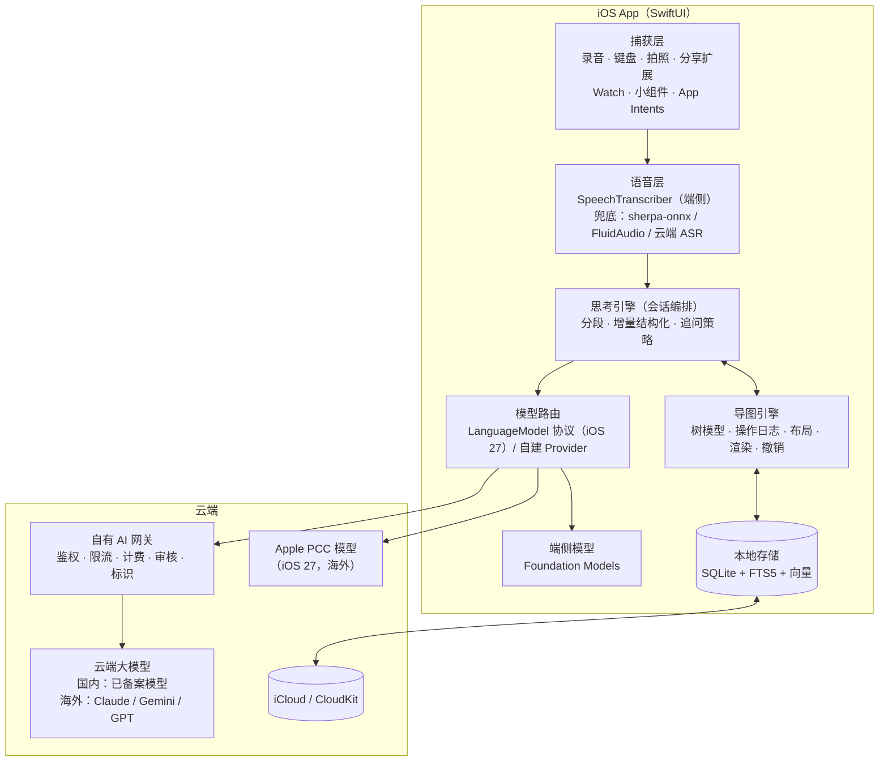
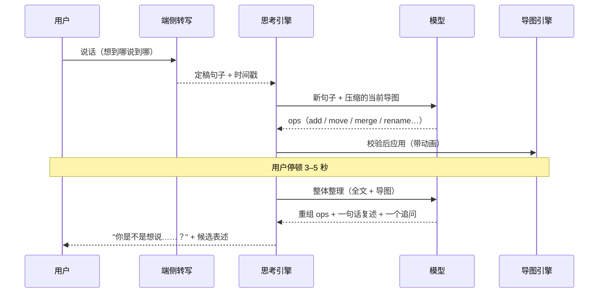

# 06 · 技术方案

> 本文给出 iOS 端的技术选型、AI 管线设计和数据模型草图。平台能力以 2026-09 为准：iOS 27 已于 2026-09-14 发布（[源](https://www.apple.com/newsroom/2026/09/major-updates-for-apples-software-platforms-are-now-available/)）。标【官】的来自 Apple 开发者文档或 WWDC26 视频，其余出处见 [05-开源项目](05-open-source.md) 和 [07-合规·商业·路线图](07-compliance-business-roadmap.md)。
>
> 2026-09-26 第二轮核实：§3.1 各项已逐条对照 Apple 文档、WWDC26 视频、Newsroom 和支持页面，**全部成立**，并补上资格细则、API 名称和限制；国行 Apple Intelligence 状态已确认（未开放）；SpeechTranscriber 的中文支持有第三方实测佐证，语音方案主线不变。新增 §3.4 语音转写路由、§3.5 可纳入计划的系统能力，§8 新增 4 项风险。

---

## 0. 选型结论

| 层 | 选择 | 理由 |
|---|---|---|
| 最低系统 | **iOS 26**（iOS 27 能力做可用性判断） | SpeechAnalyzer、Foundation Models 都要求 iOS 26；2026-04-28 起上传 App Store Connect 须用 Xcode 26 + iOS 26 SDK【官】（[源](https://developer.apple.com/news/upcoming-requirements/)） |
| UI | **SwiftUI**，必要处桥接 UIKit | 画布缩放用 UIScrollView 桥接最稳 |
| 导图渲染 | **原生自研**（方案 A）；需要极速验证时可临时用 WebView（方案 B） | 见第 2 节 |
| 存储与同步 | **SQLiteData 或 GRDB + CKSyncEngine**；以后需要协作再引入 Loro | 树结构用关系表最可控；SwiftData 的 to-many 无序，还有 CloudKit 约束 |
| 语音转写 | **SpeechTranscriber**（端侧）→ DictationTranscriber → sherpa-onnx / FluidAudio（Paraformer、Qwen3-ASR 等）→ 云端 ASR 兜底 | 免费、离线、带时间戳（可"点节点回放原声"）【官】；中文支持有第三方实测佐证，仍以首周 CER 测试定默认方案（见 §3.4） |
| LLM | **按地区和任务路由**：端侧 Foundation Models / Apple PCC / 自有后端代理的云模型 | 见第 3 节 |
| 后端 | 轻量 Serverless 网关：鉴权、限流、订阅校验、模型路由、内容审核 | API Key 绝不放客户端；中国版合规必需 |
| 检索 | 端侧 embedding + 暴力余弦 + FTS5 | 单用户数据量小，不需要向量数据库 |

---

## 1. 总体架构



**数据只以 Swift 侧为准**。AI 不直接改导图，而是输出"操作"（ops），由导图引擎校验后应用——这样 AI 的每个改动都可撤销、可追溯，也不会覆盖用户手工改过的内容。

---

## 2. 导图渲染：原生 vs WebView

| 维度 | A 原生 SwiftUI | B WKWebView + Web 引擎 |
|---|---|---|
| 首版开发量 | 大（布局、编辑、撤销、导出都要自研） | 小（simple-mind-map 现成 7 种结构） |
| "边说边长"动画、手势、触觉反馈 | 最佳 | 需要调优 |
| 中文输入法、节点内编辑 | 可靠 | contenteditable 的组词和光标问题要重点测 |
| 无障碍（VoiceOver、动态字体） | 好 | 弱 |
| Apple Pencil / PaperKit 手写 | 原生支持 | 要额外桥接 |
| 大图性能 | 可降级到 CALayer / Metal | SVG / DOM 有上限 |
| 跨平台复用 | 仅 Apple | 高 |
| License | 最干净 | 取决于引擎（simple-mind-map 有署名要求） |

**建议走 A**。理由：

- 目标用户的导图通常只有几十到两百个节点，性能不是瓶颈；
- 产品的核心体验是语音、动画、中文输入和"一次只看一层"的手机视图，这些原生做得最好；
- MVP 只需要 **1 种导图布局 + 大纲视图 + 聚焦卡片视图**，自研工作量可控。

**原生导图引擎的自研分层**：

1. **树模型**：节点表 + 排序键（fractional index）。
2. **布局**：移植 @antv/hierarchy 的 mindmap 布局（MIT，"根两侧分布 + 非分层 tidy tree"）；后台线程纯函数，输入节点尺寸、输出坐标；只增量重算受影响子树。
3. **渲染**：节点用 SwiftUI View，连线用 Canvas 画贝塞尔曲线；AI 建议节点用虚线"幽灵态"。
4. **交互**：UIScrollView 负责缩放平移；拖拽重排、折叠、就地编辑、撤销重做（基于操作日志）。
5. **导出**：ImageRenderer 出 PNG/PDF；Markdown、OPML、.xmind 由树模型序列化。

如果想**两周内先做出能给用户试的原型**，可以临时用方案 B，但坚持两条：数据以 Swift 侧为准；AI 编辑走统一的操作协议。这样渲染层可以整体替换，不用迁移数据。

---

## 3. AI 模型分层与路由

### 3.1 平台能力（2026-09，2026-09-26 逐条核实）

| 能力 | 要点 | 限制 |
|---|---|---|
| **Foundation Models 端侧模型**（iOS 26+） | 约 3B 参数；`@Generable` 约束解码保证结构正确；工具调用；流式"快照"【官】；支持语言即 Apple Intelligence 语言，**含简体、繁体中文**【官】（[源](https://support.apple.com/en-us/121115)） | 每会话上下文 4,096 token，中文约一字一 token【官】（[源](https://developer.apple.com/documentation/foundationmodels/managing-the-context-window)）；不擅长世界知识和复杂推理；仅限 Apple Intelligence 设备（iPhone 15 Pro 起，iOS 27 另需最多 8–14 GB 空间）和支持的地区（[源](https://support.apple.com/en-us/121115)） |
| **iOS 27 新端侧模型** | "从头重建"的新一代模型，逻辑和工具调用更强；支持图像输入；新增系统工具 `OCRTool`、`BarcodeReaderTool`（基于 Vision）和 `SpotlightSearchTool`（端侧 RAG）【官】（[源](https://developer.apple.com/videos/play/wwdc2026/241/)）；`SystemLanguageModel` 文档列明目前有 26.0–26.3、26.4、27.0 三个模型版本（[源](https://developer.apple.com/documentation/foundationmodels/systemlanguagemodel)） | 上下文说法不一：PCC 讲座示例代码注释"26.0 上 4096、27.0 上 8192（较新设备）"，但同一讲座口述和官方文档对比表仍写 4K【官】（[源](https://developer.apple.com/videos/play/wwdc2026/319/)、[源](https://developer.apple.com/documentation/foundationmodels/adding-server-side-intelligence-with-private-cloud-compute)）——**代码里一律运行时读取 `contextSize`**；端侧用 `SpotlightSearchTool` 须配 `.focused()` 精简配置，否则工具定义本身就超出上下文（[源](https://developer.apple.com/documentation/ios-ipados-release-notes/ios-ipados-27-release-notes)） |
| **PCC 云端模型**（iOS 27+） | `PrivateCloudComputeLanguageModel`：32K 上下文，三档推理（`.light` / `.moderate` / `.deep`）；API 与端侧完全相同，无需账号、鉴权和 API Key；**对小开发者免 API 费**；也让 Foundation Models 首次登陆 watchOS 27【官】（[源](https://developer.apple.com/documentation/foundationmodels/adding-server-side-intelligence-with-private-cloud-compute)、[源](https://developer.apple.com/videos/play/wwdc2026/241/)） | 资格：加入 App Store 小企业计划 + 名下所有 App 首次下载合计少于 200 万 + 账号获分配 entitlement `com.apple.developer.private-cloud-compute`；**超过 200 万或退出小企业计划后，须在 6 个月内迁移到其他方案**【官】（[源](https://developer.apple.com/private-cloud-compute/)）；每用户每日限额（数值未公布，iCloud+ 用户更高），用 `quotaUsage` 读状态，超限抛 `quotaLimitReached`；需联网；只在 Apple Intelligence 可用的设备和地区 |
| **LanguageModel 协议**（iOS 27+） | 第三方模型接入同一套 Session / Tool / `@Generable` API【官】（[源](https://developer.apple.com/documentation/foundationmodels/languagemodel)）；Anthropic `ClaudeForFoundationModels`（Apache-2.0，beta）（[源](https://platform.claude.com/docs/en/cli-sdks-libraries/libraries/apple-foundation-models)）、Google `GeminiLanguageModel`（Firebase AI Logic，Preview）（[源](https://firebase.google.com/docs/ai-logic/apple-foundation-models-framework/get-started)）已发布；Apple 开源 `CoreAILanguageModel`、`MLXLanguageModel` 跑本地模型【官】 | 需 iOS 27；第三方模型的鉴权和计费自理：Claude 包支持 App Attest（无后端）或 `.proxied` 走自有代理，Gemini 须启用 Firebase App Check；会话和响应新增 `usage` 属性统计 token【官】 |
| **可接受使用条款** | 禁止"导致依赖或损害心理健康的螺旋式互动"，禁止美化或促成自伤；**适用范围写明包括"经该框架调用的模型"**，即经 `LanguageModel` 协议接入的第三方模型同样受约束【官】（[源](https://developer.apple.com/apple-intelligence/acceptable-use-requirements-for-the-foundation-models-framework/)） | "倾诉"功能必须设计护栏和危机转介；条款还禁止在就业、医疗、法律、金融等高风险领域"无人监督地做出重大决定"——决策场景坚持"用户做决定、AI 只整理" |

**中国大陆**（2026-09-26 核实）：2026-07-15 前后网信办对 Apple 的端侧生成式 AI 服务完成登记，主要由阿里通义千问提供能力、百度参与，但未给上线日期（[MacRumors 转述路透](https://www.macrumors.com/2026/07/15/apple-intelligence-cleared-to-launch-in-china/)、[TechCrunch](https://techcrunch.com/2026/07/16/apple-intelligence-approved-for-launch-in-china-with-alibabas-qwen-ai/)）。iOS 27 发布时 Apple 明确"Siri AI 和其他新的 Apple Intelligence 功能在 Apple 完成监管要求前不会在中国提供"（[Newsroom 2026-09-14](https://www.apple.com/newsroom/2026/09/major-updates-for-apples-software-platforms-are-now-available/)）；Apple 支持页写明：**在中国大陆购买的设备目前无法使用 Apple Intelligence**；境外购买的设备如身处大陆且 Apple 账户地区也是大陆，同样不可用（[源](https://support.apple.com/en-us/121115)）。`SystemLanguageModel` 与 PCC 的可用性都取决于设备和地区【官】，所以在国行设备上会报不可用。原记"是否已向国行设备推送未能核实"，现已核实为**未开放**。**国行设备一律按"端侧模型和 PCC 不可用"设计**；即使将来开放，Apple 的登记不覆盖第三方 App，向公众提供生成式服务仍需自己做登记（见 07）。在国行设备上经 `LanguageModel` 协议接入国产云模型或 `MLXLanguageModel` 本地模型是否可行，文档未说明（推断：协议本身不依赖 Apple Intelligence），需国行真机验证。

### 3.2 任务路由

| 任务 | 海外版 | 中国版 | 说明 |
|---|---|---|---|
| 去口水词、切段、节点起标题、打标签 | 端侧 Foundation Models | 自有网关 → 国产小模型 | 小任务，延迟敏感 |
| **边说边长**（增量结构化） | 端侧 → PCC | 自有网关 → 国产快模型 | 每句话一次，只传增量 + 压缩的导图摘要 |
| 停顿后整体整理、追问、候选表述 | PCC → 云端大模型 | 自有网关 → 国产大模型 | 需要推理和较长上下文 |
| 成稿、对话彩排、每周回顾 | 云端大模型 | 自有网关 → 国产大模型 | 质量优先 |
| 跨导图关联 | 端侧 embedding + 模型判断关系 | 同左（embedding 端侧） | 用户确认后才建立连接 |

中国版的端侧小任务，后续可评估经 `MLXLanguageModel` 在本机跑 Apache-2.0 的 Qwen3 小模型（0.6B–4B）（推断，需验证国行设备可用性和发热）；向公众提供生成式服务的合规定性不因端侧运行而改变（见 07）。

**能力探测**（API 名称已对照文档）：

- 端侧：`SystemLanguageModel.default.availability` → `.available` 或 `.unavailable(.deviceNotEligible / .appleIntelligenceNotEnabled / .modelNotReady)`；`supportsLocale()`；`contextSize`（[源](https://developer.apple.com/documentation/foundationmodels/systemlanguagemodel)）。
- PCC：`PrivateCloudComputeLanguageModel().availability`（含 `.systemNotReady`）、`quotaUsage.isLimitReached` / `.status` / `.limitIncreaseSuggestion`，捕获 `quotaLimitReached` 错误；网络失败时退回端侧（[源](https://developer.apple.com/documentation/foundationmodels/adding-server-side-intelligence-with-private-cloud-compute)）。
- 转写：`SpeechTranscriber.isAvailable`、`supportedLocales`、`AssetInventory.status(forModules:)`。

任何一项不满足就降级到下一层。**导图编辑、端侧转写等非 AI 能力在所有机型上都可用**，AI 是增值层。

### 3.3 统一抽象

- iOS 27+：用 `LanguageModel` 协议把国产模型或自有网关包装成 Provider，同一套会话代码在端侧 / PCC / 云端之间切换。海外版接 Claude 时用官方包的 `.proxied` 模式指向自有网关，客户端不放 Key，与"后端"一行的原则一致。
- iOS 26：自建一个 Provider 协议，形状对齐 `LanguageModel`，将来平滑迁移。
- `@Generable` 结构在云端映射为 JSON Schema（结构化输出）。

### 3.4 语音转写路由（2026-09-26 新增）

| 顺序 | 方案 | 海外版 | 中国版 | 说明 |
|---|---|---|---|---|
| 1 | `SpeechTranscriber`（iOS 26+） | 默认 | 默认（推断：SpeechAnalyzer 不属于 Apple Intelligence，文档未提地区限制；需国行真机确认） | 先查 `supportedLocales` / `isAvailable`，再用 `AssetInventory` 下载 zh-CN 资产（系统管理、跨 App 共享）【官】；Apple 文档未列 locale，第三方实测称含简体、繁体、香港中文与粤语（[源](https://loronote.com/en/blog/apple-speechanalyzer-vs-whisper)） |
| 2 | `DictationTranscriber`（iOS 26+） | 设备不支持 1 时 | 同左 | 与系统听写同一套模型、兼容旧设备；可用 `contextualStrings` 偏置用户常用词【官】（[源](https://developer.apple.com/documentation/speech/dictationtranscriber)） |
| 3 | 第三方端侧：sherpa-onnx（Paraformer / SenseVoice / Qwen3-ASR）或 FluidAudio（SenseVoice / Paraformer 的 Core ML 版） | 可选 | 主兜底 | 优先 Apache-2.0 权重（Paraformer、Qwen3-ASR）；SenseVoice 走 FunASR 模型协议（见 [05](05-open-source.md) 第 5 节）；iOS 27 起后台使用神经引擎需新 entitlement（见 §8） |
| 4 | 云端 ASR | 海外厂商 | 国内已备案服务 | 上传音频需单独同意（见 §6） |

**结论**：SpeechTranscriber 缺中文的担心目前没有依据（有第三方实测列出中文 locale），**主线不变**；但首周 CER 测试必须同时覆盖 1–3，用数据决定默认方案。iOS 27 还为系统听写加入"Advanced Dictation Preview"新端侧模型（需用户在键盘设置里手动开启，非开发者 API）（[源](https://developer.apple.com/documentation/ios-ipados-release-notes/ios-ipados-27-release-notes)）。

### 3.5 可纳入计划的其他系统能力（2026-09-26 新增）

| 能力 | 本产品用途 | 要点 |
|---|---|---|
| `AudioRecordingIntent`（iOS 18+）+ Live Activity | 从控制中心、操作按钮、Siri 一键开始"倾倒" | 采用该协议后，录音开始时必须启动 Live Activity 并一直保持，否则录音会被系统停止【官】（[源](https://developer.apple.com/documentation/appintents/audiorecordingintent)） |
| App Intents 模式（schemas）与 Siri AI（iOS 27） | "记一个想法""打开上次那张导图"可被 Siri 自然语言调用；实体进入 Spotlight 语义索引 | Siri AI 首发英文 beta，法、日、韩、葡、西语 10 月跟进，中文未在首批（[源](https://www.apple.com/newsroom/2026/09/major-updates-for-apples-software-platforms-are-now-available/)、[源](https://developer.apple.com/apple-intelligence/whats-new/)） |
| `PKStrokeRecognizer`（iOS 27） | 导图上的手写批注转文字 | 端侧离线，29 种语言，WWDC 演示含中文【官】（[源](https://developer.apple.com/videos/play/wwdc2026/203/)） |
| PaperKit（iOS 26+） | 圈画、形状、文本框标注 | iOS 27 新增可读写标注元素的数据模型 API（[源](https://developer.apple.com/videos/play/wwdc2026/372/)） |
| `OCRTool`（iOS 27） | 拍白板或手写纸条 → 节点 | 系统工具，端侧 |
| `SpotlightSearchTool` + Core Spotlight 语义索引（iOS 27） | "你以前也想过"的端侧检索 | 见 §3.1 的上下文限制；中文效果待测（[源](https://developer.apple.com/videos/play/wwdc2026/246/)） |
| Evaluations 框架（iOS 27） | 第 7 节评估集的自动化回归 | Apple 建议先用它评估端侧模型，再决定是否上 PCC【官】（[源](https://developer.apple.com/documentation/foundationmodels/adding-server-side-intelligence-with-private-cloud-compute)） |
| `NLContextualEmbedding`（iOS 17+） | 跨导图关联的端侧 embedding | 官方说明中英文可能需要不同模型；资产按需下载【官】（[源](https://developer.apple.com/documentation/naturallanguage/nlcontextualembedding)） |

---

## 4. AI 管线："边说边长"是怎么实现的



### 4.1 为什么用"操作"而不是整图重新生成

- **保住用户的修改**：用户改过的节点标记为锁定，AI 不得改动；
- **省 token**：每次只传增量和压缩的导图摘要；
- **可流式、可撤销、可追溯**：每个 op 都是一条可以撤销的记录，带来源片段；
- **小模型也稳**：扁平的操作列表比深层嵌套的 JSON 更容易被约束解码。

### 4.2 操作协议（草案）

```json
{
  "ops": [
    {"op": "set_center", "text": "要不要从现在的公司离职"},
    {"op": "add", "ref": "t1", "parent": "root", "text": "现在的工作", "kind": "idea"},
    {"op": "add", "ref": "t2", "parent": "t1", "text": "工资还可以", "kind": "fact", "src": [12, 20]},
    {"op": "add", "ref": "t3", "parent": "t1", "text": "学不到新东西", "kind": "feeling", "src": [21, 40]},
    {"op": "move", "id": "n7", "parent": "t1"},
    {"op": "merge", "ids": ["n4", "n9"], "text": "担心找不到更好的"},
    {"op": "rename", "id": "n2", "text": "收入稳定"},
    {"op": "ask", "target": "t3", "type": "clarify",
     "text": "“学不到新东西”是指技能停滞，还是看不到晋升？",
     "options": ["技能停滞", "晋升无望", "两者都有"]}
  ]
}
```

**应用前校验**：ID 存在、不成环、深度 ≤ 4、不修改锁定节点、每轮最多一个 `ask`。

**给模型看的导图**用带短 ID 的缩进文本（参考 Mind Elixir 的纯文本格式），比 JSON 省 token，模型也更熟悉：

```
[root] 要不要从现在的公司离职
  [n1] 现在的工作
    [n2] 工资还可以 (fact)
    [n3] 学不到新东西 (feeling)
  [n4] 想去的方向：产品经理
```

### 4.3 结构化提示词要点

1. **只用用户说过的内容**。补充内容必须标为 AI 建议（`origin: ai`），不能冒充用户观点。
2. **节点文字保留用户的关键词**，中文不超过约 12 字；长句放进节点备注。
3. **一级分支 3–7 个**，最多 4 层；不确定归属的放进"待整理"分支，不要硬分类。
4. **标注类型**：事实 / 观点 / 感受 / 假设 / 问题 / 待办 / 决定。
5. **不要删除**用户说过的任何内容，只能合并（合并后保留全部来源）。

### 4.4 追问引擎

**选题优先级**：

1. 模糊的核心节点（"感觉""有点""那个"）；
2. 关键主张缺"为什么"；
3. 场景模板里空着的格子（例如决策场景还没有"标准"分支）；
4. 前后矛盾；
5. 情绪没被命名；
6. 缺下一步行动。

**表达规则**（来自 [03-用户洞察](03-user-insights.md)）：

- 先复述一句，再问一个问题；
- 问题短、具体、可跳过；
- 附 2–4 个候选答案 +"都不是 / 我自己说"；
- 情绪话题多问"怎么 / 什么"，少问"为什么"；
- 同一主题循环 3 次以上时，温和地转向行动或暂停。

**候选表述**：给定一个模糊节点和上下文，生成 3 个**意思不同**（而不是措辞不同）的解读。用户选中后更新节点文字，原话保留在历史里。

### 4.5 表达与练习

- **成稿**：输入导图（可选分支）+ 听众、形式、时长、语气 + 用户口吻档案（从用户自己的转写里提取常用词和句长）。输出每段都链接回节点；导图里没有的句子高亮标注为"AI 补充"。
- **练习评估**：用户讲一遍 → 端侧转写 → 对照导图计算：
  - 要点覆盖率；
  - 结论是否在前 20% 出现；
  - 口头禅频次（"嗯""然后""就是""那个"）；
  - 语速（字/分钟）；
  - 长停顿；
  - 总时长。
  - 最后由模型给出最多 3 条具体建议。

---

## 5. 数据模型（草图）

```swift
enum NodeKind: String, Codable {
    case idea, fact, opinion, feeling, assumption, question, todo, decision
}

enum NodeOrigin: String, Codable {
    case user          // 用户说的 / 写的
    case aiSuggested   // AI 补充，未确认（虚线幽灵态）
    case aiAccepted    // AI 补充，用户已认领
}

struct ThoughtNode: Identifiable, Codable {
    var id: UUID
    var mapID: UUID
    var parentID: UUID?
    var sortKey: String            // 分数索引，并发插入与同步友好
    var text: String               // 节点短句
    var note: String?              // 展开说明
    var kind: NodeKind
    var origin: NodeOrigin
    var sources: [SourceRef]       // 原话溯源
    var isLockedByUser: Bool       // 用户手动改过，AI 不得改动
    var isCollapsed: Bool
    var createdAt: Date
    var updatedAt: Date
}

struct SourceRef: Codable {
    var captureID: UUID
    var textRange: Range<Int>      // 转写文本中的字符区间
    var audioStart: TimeInterval?  // 可点击回放原声
    var audioEnd: TimeInterval?
}

struct Capture: Identifiable, Codable {      // 一次"倾倒"
    var id: UUID
    var source: CaptureSource      // voice / text / photo / share / watch / siri
    var transcript: String
    var audioFile: URL?
    var createdAt: Date
}

struct ThoughtMap: Identifiable, Codable {
    var id: UUID
    var title: String
    var scene: Scene               // messy / idea / decision / express / write / learn / feel / goal / review / meeting / free
    var status: MapStatus          // active / incubating / archived
    var isPrivate: Bool            // 私密导图：不上云、不用云端 AI
    var rootID: UUID
    var createdAt: Date
    var updatedAt: Date
}

struct CrossLink: Codable {        // 跨枝 / 跨图连接
    var from: UUID
    var to: UUID
    var relation: Relation         // because / therefore / but / example / premise / contradicts / related
    var origin: NodeOrigin
}

struct Probe: Identifiable, Codable {        // 一次追问
    var id: UUID
    var mapID: UUID
    var targetNodeID: UUID?
    var type: ProbeType            // clarify / why / example / counter / gap / converge / rephrase
    var text: String
    var options: [String]          // 候选答案或候选表述
    var status: ProbeStatus        // pending / answered / skipped
    var answer: String?
}
```

另有 `Draft`（成稿，含关联节点）、`Rehearsal`（练习记录与指标）、`Decision`（决策记录与回访日期）等表，MVP 之后再加。

---

## 6. 隐私与安全

- **本地优先**：数据默认存在设备上，同步走用户自己的 iCloud 私有库。
- **最小上传**：云端 AI 只收到当次需要的文本片段和压缩的导图摘要，不上传音频。
- **明确同意**：首次调用第三方云端 AI 前，单独弹同意页，写明厂商、数据类型、用途、保存期（App Store 5.1.2(i)，2025-11 起要求）。
- **私密导图**：单张导图可设为"不上云、不用云端 AI"。
- **不用于训练**：与模型厂商签订或选择不训练的条款，并写进隐私政策。
- **App 锁**：Face ID / 密码锁。
- **可导出、可删除**：一键导出全部数据；账户删除入口放在 App 内。
- **危机护栏**：识别到自伤等风险表达时，停止普通流程，展示专业求助资源；产品文案不做医疗或心理治疗宣称。

---

## 7. 质量评估（Evals）

AI 质量是这个产品的生命线，从第一天就要有评估集。

- **评估集**：60–100 条中文"乱说"转写，覆盖 10 个场景；来源是内测用户授权的真实录音，加上人工编写的样本。每条人工标注"必须保留的要点"和"理想结构"。
- **指标**：

| 指标 | 含义 | 目标 |
|---|---|---|
| 要点召回率 | 用户说过的要点是否都进了导图 | ≥ 90% |
| 幻觉率 | 出现用户没说过、又没标为 AI 建议的观点 | ≈ 0 |
| 结构合理性 | 人工 1–5 分 | ≥ 4 |
| 追问质量 | 是否具体、一次一问、有用（人工 1–5 分） | ≥ 4 |
| 首个节点出现时间 | 从开口到第一个节点长出来 | < 2 秒 |
| 整体整理耗时 | 停顿后到重组完成 | < 8 秒 |

- **方法**：模型评审（LLM-as-judge）跑全量，每周人工抽检 20 条；每次换模型或改提示词都要回归。Apple 端侧模型会随系统更新变化（目前已有 26.0–26.3、26.4、27.0 三个版本【官】），iOS 大版本发布后也要回归；Apple 端侧 / PCC 部分可用 iOS 27 的 Evaluations 框架跑（[源](https://developer.apple.com/documentation/foundationmodels/adding-server-side-intelligence-with-private-cloud-compute)）。
- **线上指标**：AI 建议节点的采纳率、追问回答率、用户对 AI 改动的撤销率。

---

## 8. 技术风险

| 风险 | 对策 |
|---|---|
| 中文转写质量不达标 | 首周用 50 段真实中文倾诉录音测字错率（CER），对比 SpeechTranscriber、DictationTranscriber、sherpa-onnx（Paraformer / Qwen3-ASR）、FluidAudio、云端 ASR（见 §3.4） |
| 端侧模型上下文太小 | 分段抽取 → 合并；合并阶段只传节点标题；长任务交给 PCC 或云端；上下文一律运行时读 `contextSize`，不写死 4096 或 8192 |
| 国行设备没有端侧 AI | **已核实**：国行设备目前无法使用 Apple Intelligence（[源](https://support.apple.com/en-us/121115)）。中国版全部走自有网关；端侧只做转写和 embedding（这两项在国行设备上的可用性仍需真机确认） |
| iOS 27 限制后台使用神经引擎（新增） | 后台访问神经引擎需新 entitlement `com.apple.developer.background-tasks.continued-processing.inference`【官】（[源](https://developer.apple.com/documentation/ios-ipados-release-notes/ios-ipados-27-release-notes)）；锁屏或后台录音时只录不转、回前台再转写，或优先用系统 SpeechAnalyzer（推断其不受此限，需验证）；录音入口用 `AudioRecordingIntent` + Live Activity |
| PCC 资格与额度（新增） | 首次下载超 200 万或退出小企业计划后 6 个月内须迁移【官】；用户日限额随时可能触顶——路由层必须能无缝降级到端侧或自有网关，并用 `quotaUsage` 在界面上提示额度状态；海外版的成本模型不能假设 PCC 永久免费 |
| 第三方模型许可变动（新增） | SenseVoice 的 FunASR 模型协议可由阿里单方修订；优先 Apache-2.0 权重（Paraformer、Qwen3-ASR），记录所用模型版本和许可快照 |
| Apple 使用条款覆盖第三方模型（新增） | 经 Foundation Models 框架调用的 Claude、Gemini 或国产模型同样受 Apple 可接受使用条款约束【官】；倾诉类对话的护栏不能只依赖 Apple 端侧的内置 guardrails |
| 云端延迟影响"边说边长"的手感 | 先在本地显示转写文字，节点稍后"长出来"；缓存系统提示词 |
| 大模型输出不稳定 | 约束解码 / JSON Schema + 校验 + 重试；ops 应用前校验 |
| 同步冲突导致树结构损坏 | 节点粒度的最后写入者胜 + 树完整性修复；协作时再上 Loro |
| 模型随系统更新行为漂移 | 评估集回归；关键提示词做版本管理 |
